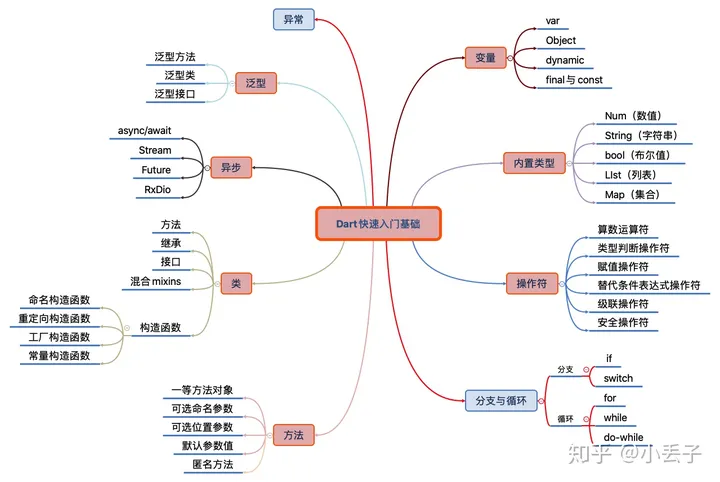
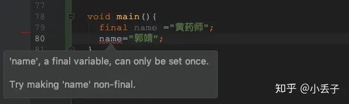
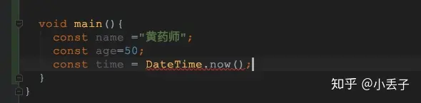

# 快速入门Dart基础

 [](https://www.zhihu.com/people/xiao-diu-zi-84)

 [小丢子](https://www.zhihu.com/people/xiao-diu-zi-84)


 27 人赞同了该文章

 教大家快速学习一门新语言：

- 第一是零基础：那我们只能靠自己脚踏实地的多写多想慢慢熟悉你所选择的语言 ，没有别的办法。（但是dart确实目前为止最好学的没有之一的语言）
- 第二是有基础：小伙伴们如何快速学习一门新语言，其实很简单，我们可以根据我们当前所掌握或者熟悉的语言对比，比如：js、java、swift等等任意一门都可以，那么剩下来我们只需要掌握与之不同的语法，然后在靠自己多写多想慢慢熟悉。

### 一、开篇（请记住并了解这些万能的规则）

- 一切变量皆是对象，每个对象都是类的实例。int、double、函数、 null 等都是对象，所有对象都继承自 Object 类
- Dart可基于AOT（Ahead Of Time）编译，即编译成平台的本地代码，运行性能高。
- Dart也可基于JIT（Just In Time）编译，编译快速，可热加载，使开发周期加倍提升（Flutter亚秒级有状态热重载）
- Dart可以更轻松地创建以60fps运行的流畅动画和转场。Dart在没有锁的情况下进行对象分配和垃圾回收
- Dart语法结合Java与JavaScript语法特点，几乎没有令人不适的怪异语法，使Java程序员倍感亲切，快速上手
- Dart 没有关于 public、protected、private 的关键字。通过为变量标识符添加下划线前缀，表明该标识符对其库是私有的
- Dart支持顶级函数、静态函数、实例函数，也允许在函数中嵌套函数，即局部函数。类似的，dart 也支持顶级变量、静态变量和实例变量
- Dart 是强类型语言，但由于具备类型推导功能所以类型声明是可选的

### 二、Dart快速入门基础目录：

 

 

 

### 本文分三节讲解：

 | 章节 | 介绍 | | ---- | ---- | | | 上： | | | 中： | | | 下： |

### 三、开发工具选择

### 编译器主要采用Android Studio编译器

 同时按照国际惯例使用Dart完成一个："Hello，World!" 并输入运行结果：

```dart
 import 'dart:core';
 
 void main() {
   print('Hello，World');
 }
```

### 四、变量

 Dart中定义变量有两种方式: *一、静态类型语言常用的方式，显式指定变量类型。* 二、动态语言的常用方式，不指定类型，由vm自动推断。

 一切变量皆是对象，每个对象都是类的实例。int、double、函数、 null 等都是对象，所有对象都继承自 Object 类。下面我们看看如何声明变量：

 变量是一个引用，未初始化的变量值是Null如下。

```dart
 import 'dart:core';
 
 void main() {
  String name;
  print('$name'); //输出为null
 }
```

 上面我们提到了显示指定变量类型如下：

```dart
 import 'dart:core';
 
 void main() {
  String name ="黄药师";
  int age =10;
  print('$name''----$age'); //输出:黄药师----10
 }
```

 动态语言的常用方式，不指定类型，由vm自动推断。

```dart
 import 'dart:core';
 
 void main() {
  String name ="黄药师";
  name  ='周伯通';
  print('$name'); //输出:周伯通
 }
```

 Dart 语言是强类型语言，无法将一个已声明具体变量类型的变量赋值为另一个无继承关系的变量

```dart
 import 'dart:core';
 
 void main() {
  String name ="黄药师";
  name  =10;
  print('$name');
 }
```

 这种赋值的时候就会报错：

```dart
 import 'dart:core';
 
 void main() {
  int age =10;
  age  =10.0; //这种在赋值的时候就已经报错
  print('$age');
 }
```

 但是这个地方有个需要注意的地方就是int 和double 类都是num的子类如下面写法是合法。

```dart
 import 'dart:core';
 
 void main() {
  num age =10;
  age  =10.0; //这种在赋值合法
  print('$age');
 }
```

### 1、var（官方风格指南建议使用var）

 var：在声明变量在赋值的那一刻，就已经决定了它是什么类型。

 上面这句话是什么意思尼？其实很简单：

```dart
 import 'dart:core';
 
 void main() {
   //age 已经确定为num类型并为其赋值18岁，如果你赋值字符串，那么就会报错
  var age =18;
  age  ='18';
  print('$age');
 }
 import 'dart:core';
 
 void main() {
   //age 已经确定为num类型并但是没有为其赋值，如果你赋值字符串那么是正确
  var age;
  age  =18;
  age ='18';
  print('$age');
 }
```

### 2、Object

 一切变量皆是对象，每个对象都是类的实例。int、double、函数、 null 等都是对象，所有对象都继承自 Object 类

```dart
 import 'dart:core';
 void main() {
  Object age ='18';
  age  =18;
  print('$age');
 }
```

### 3、dynamic

 dynamic类似java中的Object ，所以声明的变量行为与Object一样，使用也是一样，但是我们需要知道的是：dynamic不是在编译时确定类型的，而是在运行时：这句话有点懵，到底是什么意思呢？

```dart
 import 'dart:core';
 
 void main() {
   dynamic name ='黄药师';
   print(name.runtimeType); //输入：String
   name =18;
   print(name.runtimeType); //输入：int
 }

```

### 说明：

 在声明变量的时候，也可以选择加上具体 类型：String name = “黄药师”

 没有初始化的变量自动获取一个默认值为 null（类型为数字的 变量如何没有初始化其值也是 null）。

### 对于局部变量，按照dart官方建议使用var来声明变量

### 4、final与const

 final 和const 从本质上看不出区别：如果你希望一个变量在赋值后其引用不能再改变，可以通过final或const这两个关键字来实现。 * final是运行时常量，final的要求是其声明的变量在赋值以后是不能在改变:

 

 

 

### final有两种使用场景

- 类中的变量声明，必须在声明时赋值。
- 类中的成员变量声明，可以在声明时候赋值，也可以通过构造函数赋值如：

```dart
 import 'package:flutter/cupertino.dart';
 
 class TestDart extends StatefulWidget{
 
   final String name;
 
   TestDart(this.name);
 
   @override
   State<StatefulWidget createState() {
     // TODO: implement createState
     return null;
   }
 }
 
 class TestDartState extends State<TestDart{
 
   final String  URL_NAME ="https://wwww.baidu.com";
 
   @override
   Widget build(BuildContext context) {
     // TODO: implement build
     return null;
   }
 
 }

```

### const是编译期常量。这里关键点区分什么是编译时常量，说白了就是其定义的值必须是一个字面常量值如下图：

 

 

 

 针对final 和const 理解的有点模糊的可以参考这篇文章： 可以参考这里[Flutter 知识梳理（Dart）-Dart中static final const 区别](https://link.zhihu.com/?target=https%3A//juejin.im/post/5d396a03f265da1b68370110%23heading-5)

### 五、操作符：

 Dart中的操作符与面向对象语言中（如：java）操作符绝大多数是相同。该有的都有，不该有的Dart也有 。

 | 操作符 | 说明 | | :----- | ----------: | | + | 加 | | _ | 减 | | * | 乘 | | / | 除 | | % | 取模运算 元 | | ~/ | 整除 | | = | 箭头函数 |

```dart
 import 'dart:core';
 
 void main() {
   var i = 6;
   var r = 2;
 
   //加法：
   print('${i + r}'); //输出：8
   //减法
   print('${i - r}'); //输出：4
   //乘法
   print('${i * r}'); //输出：12
   //除法
   print('${i / r}'); //输出：3.0
   //取模运算
   print('${i % r}'); //输出：0
   //整除
   print('${i ~/ r}'); //输出：3
 }

```

- 类型判断操作符

 as类型转换is如果对象是指定的类型返回 Trueis！如果对象是指定的类型返回 False

### 注意点：as 操作符把对象转换为特定的类型，但是如果无法完成转换则会抛出一个异常

```dart
 import 'dart:core';
 
 void main() {
   var name = "黄药师";
 
   if (name is String) {
     //判断条件为 true
     print("name is String");
   }
   var age = 1;
   if (age is! String) {
     //判断条件为 true
     print("age is String");
   }
 
   //说明：由于age 是int 类型 不是一个String类型，所以活报如下错误
   //'int' is not a subtype of type 'String' in type cast
   String newResult = age as String;
 }

```

- 赋值操作符

 | 操作符 | 说明 | | :----- | ---------------: | | = | 赋值操作符 | | += | 加和赋值操作符 | | -= | 减和赋值操作符 | | *= | 乘和赋值操作符 | | %= | 取模和赋值操作符 | | /= | 除和赋值操作符 | | ??= | 值为null的变量值 |

```dart
 import 'dart:core';
 
 void main() {
    var age =20;
    //加和赋值操作符
    print('${age+=10}');
    //减和赋值操作符
    print('${age-=10}');
    //乘和赋值操作符
    print('${age*=10}');
    //除和赋值操作符
    double newAge =20.0;
    print('${newAge /= 10.0}');
    //取模和赋值操作符
    double price =230.0;
    print('${price %= 10.0}');
 
    String name;
    name ??= "黄药师";
    // 如果 name 是 null，则把等于号右边的值 赋值给 name；
    // 如果不是 null，则 name 的值保持不变
     print("$name"); //输出：黄药师
 }

```

- 替代条件表达式操作符

### 在Dart中有两种特殊操作符可以替代 if-else 语句

- 三目运算符
- ??

```dart
 import 'dart:core';
 
 void main() {
   var age = 10;
   print(printAge1(age));
   print(printAge2(age));
   print(printAge3(age));
 }
 
 //if-else
 printAge1(age) {
   if (age == 10) {
     return age;
   }
   return age;
 
   //输出：10
 }
 
 //第一种替换if-else 使用三目运算符
 printAge2(int age) {
   return age == 10 ? age : 0; //输出：10
 }
 
 //第二种用"??"替换if-else
 printAge3(int age) {
   return age == 10 ?? 0; //输出：true
 }

```

- 级联操作符

 级联操作符 (..) 可以在同一个对象上 连续调用多个函数以及访问成员变量。 使用级联操作符可以避免创建 临时变量， 并且写出来的代码看起来 更加流畅：

```dart
 import 'dart:core';
 
 void main() {
   var  list = List();
   print("${list..add("黄药师")..add("郭靖")}"); //输出：黄药师,郭靖
 }

```

- 安全操作符

 Dart提供了 ?.操作符。左边的操作对象 如果 为 null 则返回 null

```dart
 import 'dart:core';
 void main() {
   String name;
   //没有添加"?"空指针
   print(name.length); // The getter 'length' was called on null.
   //添加"？"
   print(name?.length); //输出null
 }

```

### 六、内置类型：

### 1、num（数值）

 dart的num类型有量两种分别是int 和double两种，这两种都是num的子类。

```dart
 void main() {
   var age = 18;
   print(age.runtimeType); //输出 int
 
   var price = 8.0;
   print(price.runtimeType); //输出：double
 
   num year = 2020;
   print(year.runtimeType); //输出：int
 
   year = 2020.0;
   print(year.runtimeType); //输出：double
 
   int days = 10;
   print(days.runtimeType); //输出：int
 
   double limit = 8.90;
   print(limit.runtimeType); //输出：double
 }

```

 同时num也支持一些数据类型的转换：

```dart
 void main() {
   var age = '18';
   print(age.runtimeType); //输出：String 类型
 
   int parseAge = int.parse(age);
   print(parseAge.runtimeType); //输出：int 类型
 }

```

### 2、string（字符串）

 Dart字符串是UTF-16编码的字符序列，可以使用单引号或者双引号来创建字符串，单引号和双引号可以嵌套使用，否则需要使用\进行转义。字符串中也可以引用变量与表达式，同时可以实现字符串拼接功能

```dart
 import 'dart:core';
 
 void main() {
   var name = '黄药师';
   print(name.runtimeType); //输出：String 类型
 
   var newName1 = "my name is $name";
   print(newName1); //输出：my name is 黄药师
 
   //和上面反之，需要添加上{}
   var nameName2 = "my name is ${User().name}";
   print(nameName2); //输出：my name is 黄药师
 }
 
 class User {
   var age =10;
   var name ="黄药师";
 }

```

 提供一个 r 前缀可以创建一个 “原始 raw” 字符串，说白了就是不需要转义（如果添加上转义字符那么将会失效）如下：

```dart
 import 'dart:core';
 
 void main() {
   //r:不需要转义
   print(r"换行符: \n"); //输出：换行符：\n
   print("换行符: \\n"); //输出：换行符：\n
 }

```

### 3、bool（布尔值）

 Dart有个类型名字为bool 类型，而在Dart中只有两个对象是布尔类型：分别是true和false。在Dart中还强类型检查，只有当为true的时候才会真。

```dart
 import 'dart:core';
 
 void main() {
  bool isLoading;
  print('$isLoading'); //输出：null;
 
  isLoading =true;
  print('$isLoading'); //输出：true;
 }

```

### 4、list（数组）

 几乎所有的编程语言中数组是必不可少的，而在Dart中 list 也是必不可少的。

 下面我们来看一下List一些基本用法:

- 初始化

```dart
 import 'dart:core';
 
 void main() {
   var names = List();
   print(names.length); //输出：0;
 
   var names1 = List(2);
   print(names1.length); //输出：2;
 
   //如果想要为 List 添加不同数据类型的变量，则需要直接只买数据类型为Object
   var names2 = List<Object();
   names2.add('黄药师');
   print(names2.runtimeType); //输出：List<Object 类型
 
   //直接复制，可以添加不同类型
   var names3 = ['黄药师',12,11.0];
   print(names3.length); //输出：3
 
   //在list 字面上之前添加const 关键字，可以定义一个不变的list对象（编译是常量）
   var names4 = const[1,2,3];
   print(names4.length); //输出：3
   ///如果为names4集合添加一个值如下操作，这种操作是错误，list不可变
   ///报错：Cannot add to an unmodifiable list
   names4.add(4);
 }

```

- 常用属性和方法

```dart
 import 'dart:core';
 
 import 'package:myfirstflutter/test/user.dart';
 
 void main() {
   var names1 = [1, 2, 3];
   print(names1.length); //输出：0;
 
   //排序
   List<User myList = [User('黄药师', 23), User('欧阳锋', 61), User('杨过', 48)];
   myList.sort((a, b) = (b.age).compareTo(a.age));
 
   //集合循环
   myList.forEach((v) {
     print('${v.name}${v.age}'); //输出：欧阳锋61，杨过48，黄药师23
   });
 
   //查找符合条件
   var result = myList.where((v) = v.age == 23);
   result.forEach((v){
     //isEmpty属性，返回列表是否为空
     print('${v.name}${v.age}');
   });
   //isEmpty属性，返回列表是否为空
   print(myList.isEmpty);
 
   //isNotEmpty属性，返回列表是否有元素
   print(myList.isNotEmpty);
 
   //获取List中的第一个元素
   print("获取List中第一个元素${names1.first}");
 }

```

- 添加数据

```dart
 import 'dart:core';
 
 void main() {
   var names1 = ['杨过', '小龙女', '黄蓉'];
   //添加数据
   names1.add('丘处机');
   print(names1.length); //输出：4;
 
   var names2 = List(2);
 
   ///当执行add 时候会报错：Cannot add to a fixed-length list
   ///（固定长度的list是不能通过add添加数据）
   ///names2.add(1);
 
   //固定长度的list使用一下方式可以设置数据
   names2[0] = '黄药师';
   names2[1] = '欧阳锋';
   names2.forEach((v) {
     print('$v'); //输出：黄药师 欧阳锋
   });
 
   var names3 = ['杨过', '小龙女', '黄蓉'];
   var names4 = ['1', '2', '3'];
   //添加全部元素
   names3.addAll(names4);
   names3.forEach((v) {
     print('$v'); //输出：杨过 小龙女 黄蓉 1 2 3
   });
 }

```

- 删除数据

```dart
 import 'dart:core';
 
 void main() {
   var names1 = ['杨过', '小龙女', '黄蓉', '丘处机', '黄药师'];
   //删除指定元素
   names1.remove('杨过');
   print(names1); //输出：小龙女 黄蓉 丘处机 黄药师
 
   //删除最后一个元素
   names1.removeLast();
   print(names1); //输出：小龙女 黄蓉 丘处机
 
   //删除指定位置元素
   names1.removeAt(names1.length - 1);
   print(names1); //输出：小龙女 黄蓉
 
   //删除指定位区域元素
   names1.removeRange(0, 1);
   print(names1); //输出 黄蓉
 
   //下面这个方法是将列表List中的toString只有的字符串的长度等于3的元素全部删除
   names1.removeWhere((item) =item.toString().length==3);
   print('删除列表中toString后长度为3的元素：==$names1');
 }

```

 以上还少“改”和“查” 其实这些在上面的例子代码中已经存在了一些，这里留个大家一个练习题：可以自行把“改”和“查”自己总结一下

### 5、Map（集合）

 Map和lList一样基本上只要学习开发语言map也是必不可少的一部分，Map是键值对相关的对象。 键和值可以是任何类型的对象。每个键只出现一次， 而一个值则可以出现多次。

```dart
 import 'dart:core';
 
 void main() {
   //直接声明，用{}表示。里面写key和value 每组键值对中间用逗号隔开
   var names = {'name1': '黄药师', 'name2': '杨过', 'name3': '老顽童'};
   print(names); //输出：{name1:黄药师，name2: 杨过, name3:老顽童}
 
   var names1 = Map();
   names1['name1'] = '黄蓉';
   names1['name2'] = '黄药师';
   names1['name3'] = '郭靖';
   print(names1); //{'name1': '黄蓉', 'name2': '黄药师', 'name3': '郭靖'};
 
   //限定Map 可以存储的数据类型
   var names2 = <String, String{'name': '黄药师'};
   print(names2); //输出：{'name':'黄药师'}
 
   //与list List类似，要创建一个编译时常量的Map需要在Map的字面量前加上const 关键字
   var names3 = const {'name': '黄药师', 'age': 60};
   print(names3); //输出：{'name':'黄药师','age' : 60}
 
   //循环
   names1.forEach((k, v) {
     print(v); //输出：黄蓉，黄药师。郭靖
   });
 
   //查询删除
   var names4 = {'name1': '黄药师', 'name2': '杨过', 'name3': '老顽童'};
   names4.removeWhere((k, v) = k == 'name1');
 
   names4.forEach((k, v) {
     print(v); //输出：杨过，老顽童
   });
 
   //根据指定key 进行删除
   names4.remove('name1');
   //找找是否包含指定key
   names4.containsKey('name2');
 
   //找找是否包含指定value
   names4.containsValue('老顽童');
 
   //添加一个Map对象
   names4.addAll({'name': '丘处机'});
 }

```

 Map和List一样，同样有增删改查功能

### 七、分支与循环：

 分支 Dart分支目前有if-else 和switch两种

- if条件分支：

```dart
 import 'dart:core';
 
 void main() {
   var age = 18;
   if (age < 0) {
     print('age < 0');
   } else if (age == 0) {
     print('age = 0');
   } else {
     print('age  0');
   }
 }

```

- switch条件分支:

```dart
 import 'dart:core';
 
 void main() {
   // 在switch的case中可以使用整数、字符串、枚举类型和编译时常量
   String name = '黄药师';
   switch (name) {
     case '郭靖':
       break;
     case '老顽童':
       break;
     default:
       print('Default');
   }
 }

```

 Dart中循环支持 for、while 以及 do-while 三种。

```dart
 import 'dart:core';
 
 void main() {
   // for循环
   for (int i = 0; i < 9; i++) {
     print(i);
   }
 
   // while循环
   while (true) {
     //do something
   }
 
   //do-while循环
   do {
     //do something
   } while (true);
 }

```

 但是在Dart 还有一些特有的系统循环函数

```dart
 import 'dart:core';
 
 void main() {
   var names = ["张无忌", "小龙女", "赵敏"];
   // for...in...循环，是增强for
   for (var it in names) {
     print(it); // 输出："张无忌","小龙女","赵敏"
   }
 
   //forEach循环。其参数为一个Function对象，这里传入一个匿名函数
   names.forEach((v) {
     print(v); // 输出："张无忌","小龙女","赵敏"
   });
 
   names.forEach((v) = print(v)); //输出："张无忌","小龙女","赵敏"
 }

```

 我们在来看一下在Dart中怎么去对一组Map数据进行循环

```dart
 import 'dart:core';
 
 void main() {
   var myMap = {'name': '黄药师', 'age': '50', 'skills': '弹指神通'};
   //forEach遍历Map
   myMap.forEach(
       (k, v) = print("$k : $v")); //输出：name : 黄药师   age : 50   skills : 弹指神通
 
   //根据键获取值来遍历。通过keys返回Map中所有键的集合
   for (var k in myMap.keys) {
     print("$k : ${myMap[k]}");//输出：name : 黄药师   age : 50   skills : 弹指神通
   }
 }

```

### 总结：

 看是不是超级好上手，好操作~其实Dart的整个学习起来还是蛮简单的，对于有基础的老司机更简单一些。分分钟敲起来~

 这篇文章就简单的介绍到这里如何短时间快速入门Dart，避免入坑。由于是想让大家快速入门Flutter，所以针对上面的这些章节我们讲解的只是一些在开发Flutter 过程中常用的一些方法和函数。如果要想对Dart有更深的了解和学习，后期可以关注我哦，如有问题可以直接在下方留言。

 感觉不错可以点赞加关注，我会持续输出优质的文章。