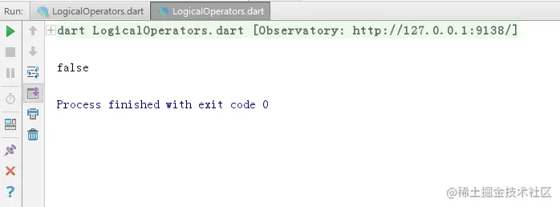
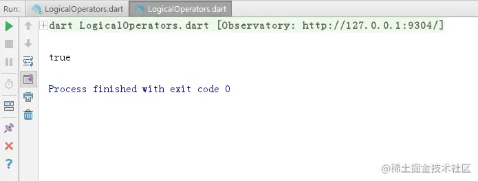
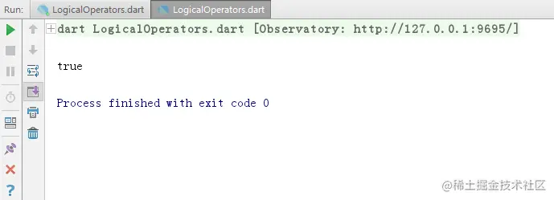
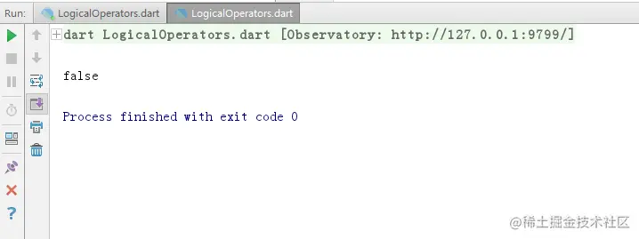
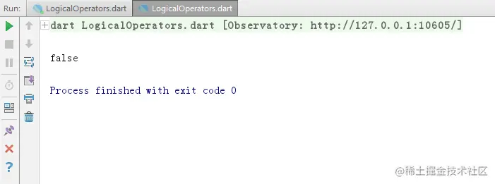
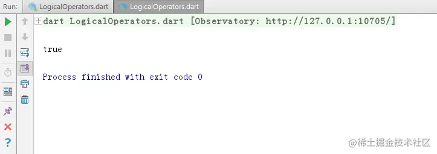

# Dart 逻辑运算符

[](https://juejin.cn/user/184373684214733)

[cekiasoo](https://juejin.cn/user/184373684214733)

2018年09月22日 16:06 ·  阅读 1894

### 一、什么是逻辑运算符

逻辑运算符是表示逻辑与、逻辑或、逻辑非的，好像高中数学有讲这个，

| 运算符 | 解释   |
| ------ | ------ |
| &&     | 逻辑与 |
| \|\|   | 逻辑或 |
| !expr  | 逻辑非 |

### 二、逻辑运算符的用法

#### （一） 逻辑与

逻辑与在 Dart 用 "&&" 表示，"&&" 的左边和右边写条件，当两个条件为真时返回true, 否则返回 false, 比如说有一把锁是要两把不同的钥匙才能解开的，如果只有其中一把钥匙是解不开的，两把都没有就更不用说了（我砸锁不行么）
用法：条件 A && 条件 B
逻辑与真值表

| 条件 A | 条件 B | 结果  |
| ------ | ------ | ----- |
| true   | true   | true  |
| true   | false  | false |
| false  | true   | false |
| false  | false  | false |

```ini
bool hasKey1 = true;
bool hasKey2 = false;
print(hasKey1 && hasKey2);
复制代码
```





```ini
bool hasKey1 = true;
bool hasKey2 = true;
print(hasKey1 && hasKey2);
复制代码
```





#### （二） 逻辑或

逻辑或在 Dart 用 "||" 表示，"||" 的左边和右边写条件，当两个条件只要有一个为真时返回true, 否则返回 false，比如说电灯是可以设置两个开关的，只要其中一个开关通电了就可以亮，只有两个开关都没通时才没亮，
用法：条件 A && 条件 B
逻辑或真值表

| 条件 A | 条件 B | 结果  |
| ------ | ------ | ----- |
| true   | true   | true  |
| true   | false  | true  |
| false  | true   | true  |
| false  | false  | false |

```ini
bool switch1 = true;
bool switch2 = false;
print(switch1 || switch2);
复制代码
```





```ini
bool switch1 = false;
bool switch2 = false;
print(switch1 || switch2);
复制代码
```





#### （三） 逻辑非

逻辑非在 Dart 用 "!expr" 表示, expr 即 expression, 如果条件是真的结果就是 false, 如果条件是假的那结果是 true, 比如说要去上班，加上非之后就是不去上班，

```ini
bool goToWork = true;
print(!goToWork);
复制代码
```





```ini
bool goToWork = false;
print(!goToWork);
复制代码
```




