# Dart 关系运算符

[](https://juejin.cn/user/184373684214733)

[cekiasoo](https://juejin.cn/user/184373684214733)

2018年09月22日 16:05 ·  阅读 2116

### 一、什么是关系运算符

关系运算符就是比较两个数的大小的，Dart 中的关系运算符有

| 运算符 | 解释       |
| ------ | ---------- |
| ==     | 等于       |
| >      | 大于       |
| >=     | 大于或等于 |
| <      | 小于       |
| <=     | 小于或等于 |
| !=     | 不等于     |


### 二、关系运算符的用法

#### (一) 等于

等于在 Dart 用 "==" 表示, 第一个数和第二个数相同就返回 true, 否则返回 false,

```ini
  int a = 10;
  int b = 11;
  print(a == b);
复制代码
```


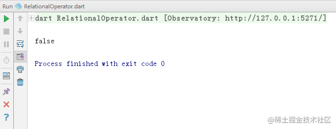


```ini
  int a = 10;
  int b = 10;
  print(a == b);
复制代码
```


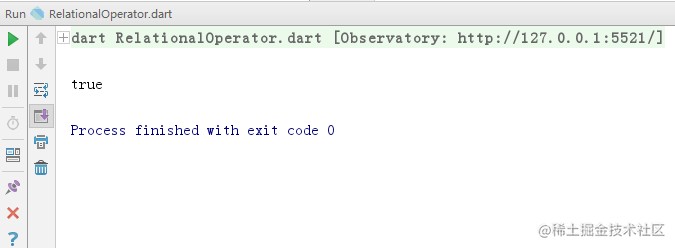


#### (二) 大于

大于在 Dart 用 ">" 表示，第一个数比第二个数大就返回 true, 否则返回 false,

```ini
  int a = 8;
  int b = 6;
  print(a > b);
复制代码
```


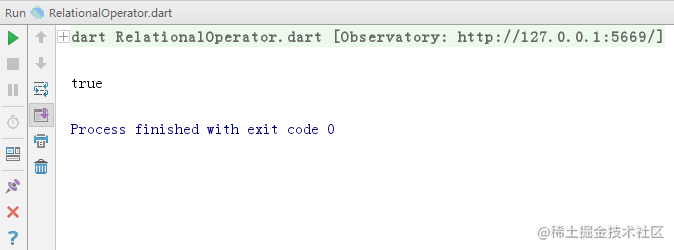


```ini
  int a = 8;
  int b = 10;
  print(a > b);
复制代码
```


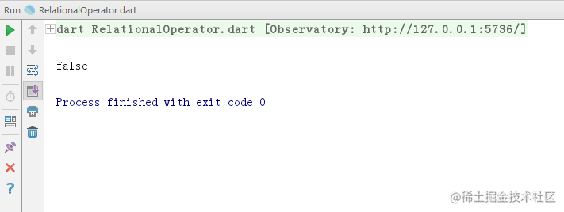


#### (三) 大于或等于

大于或等于在 Dart 用 ">=" 表示，第一个数大于或等于第二个数就返回 true, 否则返回 false,

```ini
  int a = 22;
  int b = 3;
  print(a >= b);
复制代码
```


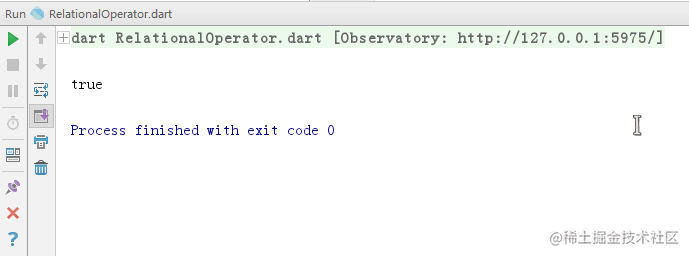


```ini
  int a = 22;
  int b = 22;
  print(a >= b);
复制代码
```


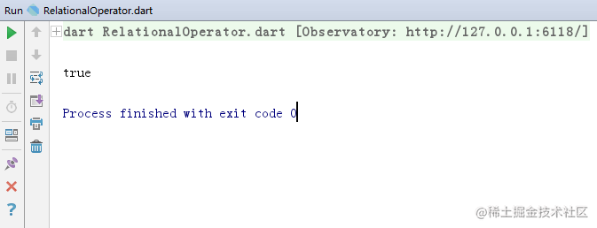


```ini
  int a = 22;
  int b = 25;
  print(a >= b);
复制代码
```


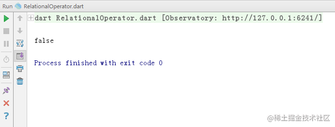


#### (四) 小于

小于在 Dart 用 "<" 表示，第一个数小于第二个数返回 true, 否则返回 false,

```ini
  int a = 88;
  int b = 89;
  print(a < b);
复制代码
```


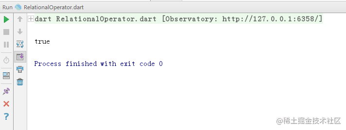


```ini
  int a = 88;
  int b = 87;
  print(a < b);
复制代码
```


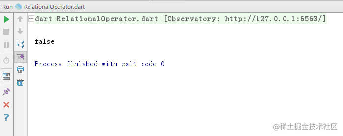


#### (五) 小于或等于

小于或等于在 Dart 用 "<=" 表示，第一个数小于或等于第二个数就返回 true, 否则返回 false,

```ini
  int a = 36;
  int b = 37;
  print(a <= b);
复制代码
```


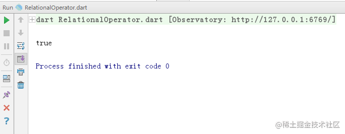


```ini
  int a = 36;
  int b = 36;
  print(a <= b);
复制代码
```


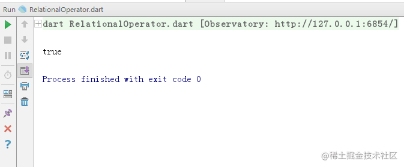


```ini
  int a = 36;
  int b = 35;
  print(a <= b);
复制代码
```


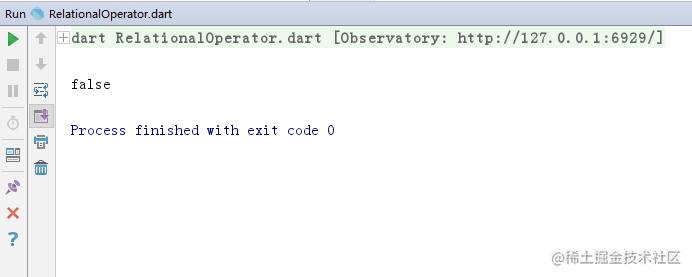


#### (六) 不等于

不等于在 Dart 中用 "!=" 表示，第一个数和第二个数不相同返回 true, 相同返回 false,

```ini
  int a = 666;
  int b = 999;
  print(a != b);
复制代码
```


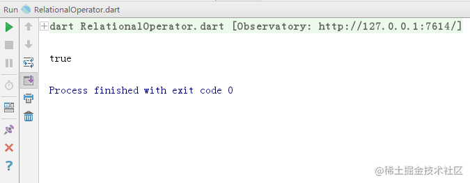


```ini
  int a = 666;
  int b = 666;
  print(a != b);
复制代码
```