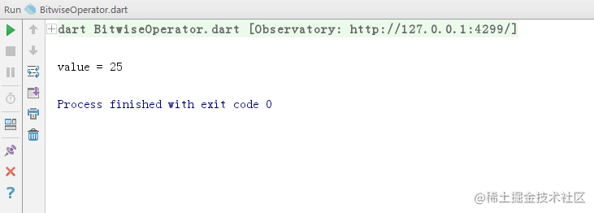

# Dart 按位运算符

[](https://juejin.cn/user/184373684214733)

[cekiasoo](https://juejin.cn/user/184373684214733)

2018年09月22日 16:09 ·  阅读 2892

### 一、什么是按位运算符

按位运算符就是操作整数二进制位的运算，Dart 中按位操作符有

| 运算符 | 解释     |
| ------ | -------- |
| &      | 按位与   |
| \|     | 按位或   |
| ~expr  | 按位非   |
| ^      | 按位异或 |

### 二、按位运算符的用法

#### （一） 按位与

按位与在 Dart 中用 "&" 表示，"&" 两边写整数，俩二进制相同位数都是 1 的话，那个相同位的结果就是 1 ，否则为 0 ，比如说 22 的二进制是 10110，15 的二进制是 1111，不够的补 0，所以 20 & 15 的运算如下(Dart int 好像没有说占多少字节的，所以这里用 32 位的代替，下同)：


计算结果为 110，即十进制的 6，

```ini
  var value = 22 & 15;
  print('value = $value');
复制代码
```


#### （二） 按位或

按位或在 Dart 中用 "|" 表示，"|" 两边写整数，俩二进制相同位只要有一个是 1，那个相同位的结果是 1，当相同位的两个都是 0 时，那个相同位的结果才是 0 ，又拿 22 和 15 来说， 22 的二进制是 10110，15 的二进制是 1111，不够的补 0，所以 20 | 15 的运算如下：


计算结果为 11111，即十进制的 31，

```ini
  var value = 22 | 15;
  print('value = $value');
复制代码
```


#### （三） 按位非

按位非在 Dart 中用 "~expr" 表示，"~" 右边写整数，把整数转为 2 进制，2 进制中 0 的结果是 1 ，1 的结果是 0，以 31 为例吧，31 的二进制是 11111，~31 的运算如下：


计算结果为 11111111 11111111 11111111 11100000，即十进制的 -32，用计算器验证一下吧，


```ini
  var value = ~31;
  print('value = $value');
复制代码
```


#### （四） 按位异或

按位异或在 Dart 中用 "^" 表示，"^" 左边和右边写整数，把整数转为 2 进制，俩 2 进制中相同位的只有一个是 1 的结果才是 1 ，俩 2 进制中相同位都是 1 或 都是 0 的结果是 0，拿 22 和 15 来说， 22 的二进制是 10110，15 的二进制是 1111，22 ^ 15 的运算如下：


计算结果为 11001，即十进制的 25，

```ini
  var value = 22 ^ 15;
  print('value = $value');
复制代码
```


