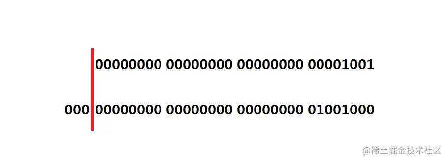
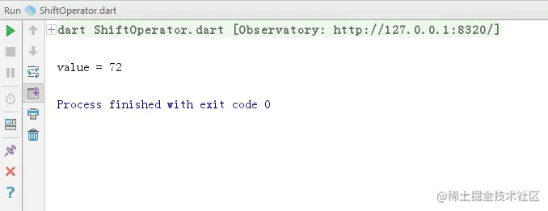
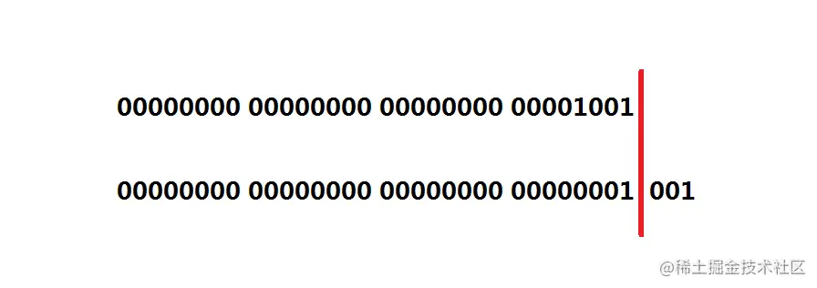
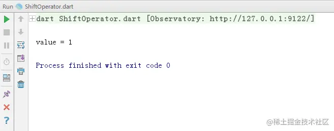

# Dart 移位运算符

[](https://juejin.cn/user/184373684214733)

[cekiasoo](https://juejin.cn/user/184373684214733)

2018年09月22日 16:09 ·  阅读 2405

### 一、什么是移位运算符

移位运算符也是对整数的二进制进行操作的，Dart 中移位操作符有

| 运算符 | 解释 |
| ------ | ---- |
| <<     | 左移 |
| >>     | 右移 |

### 二、移位运算符的用法

#### （一） 左移

左移就是二进制位向左移动，低位的补 0 ，如果有最高位的话移出的就不要，不过 Dart 的 int 应该没最高位，但是移过多位会出现 Exhausted heap space，拿 9 左移 3 位来说，9 的二进制是 1001，左移 3 位是 1001000，即十进制的 72，





```ini
  int value = 9 << 3;
  print('value = $value');
复制代码
```





#### （二） 右移

右移自然就是二进制位向右移动了，低位移出了的就不要了，高位正数补 0，负数补 1，还是拿 9 右移 3 位来说，9 的二进制是 1001，右移 3 位 001 被移了出去，就不要了，剩 1，所以结果是 1，十进制也是 1，





```ini
  int value = 9 >> 3;
  print('value = $value');
复制代码
```





  