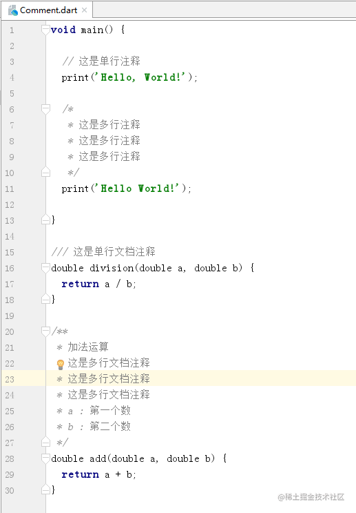

# Dart 注释

[cekiasoo](https://juejin.cn/user/184373684214733)

2018年09月22日 15:52 ·  阅读 240

### 一、什么是注释

注释呢就是用于解释和说明代码的，适当地注释代码可增强代码的可读性的，Dart 也是支持注释的，注释一般是不会影响到代码的执行的，除了 HTML 的条件注释，这里说的是 Dart ，注释自然对 Dart 的代码执行是没影响的。

### 二、单行注释

单行注释就是只有一行的注释，单行注释比较方便，以 "//" 开头，"//" 后面写注释内容。

### 三、多行注释

多行注释是可以跨越多行的，多行文档注释是以 "/*" 开头的， 接着写注释内容

最后 "*/" 结束

多行注释写成一行也是可以的

有些人喜欢这种风格的多行注释，每行注释前面加个 *

### 四、文档注释

文档注释是用于代码文档编写的，Dart SDK 有个 dartdoc 工具，用于生成文档的，具体可以看这里 [Dart SDK 工具生成文档](https://link.juejin.cn/?target=https%3A%2F%2Fgithub.com%2Fdart-lang%2Fdartdoc%23generating-docs)

文档注释也有分单行和多行的；

#### （一）单行文档注释

单行文档注释是以 "///" 开头的，三个 ‘'/" ，后面写内容

#### （二）多行文档注释

多行文档注释是以 "/**" 开头的，后面写注释内容

最后 "*/" 结束

