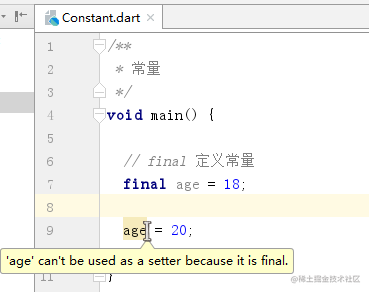
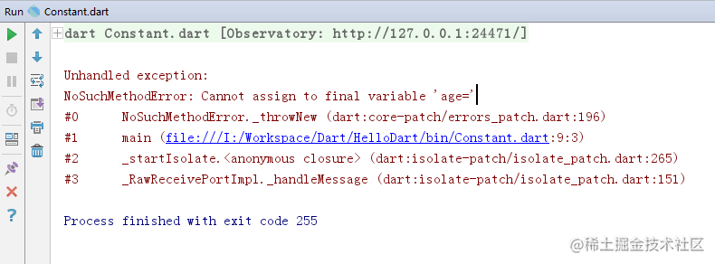
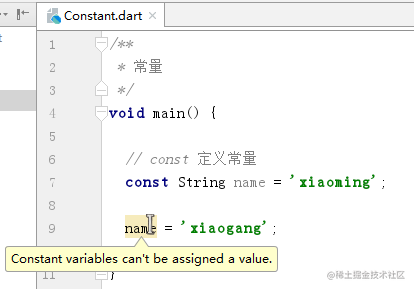
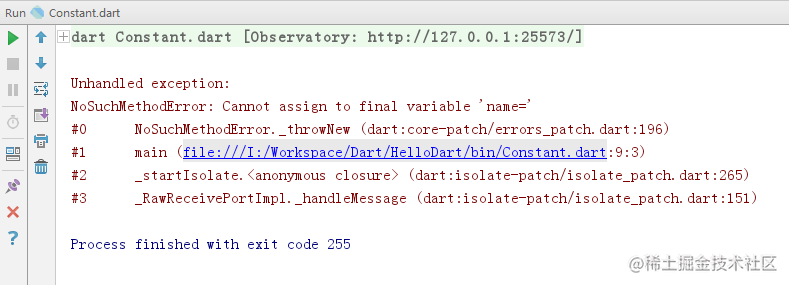
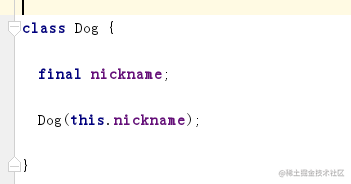
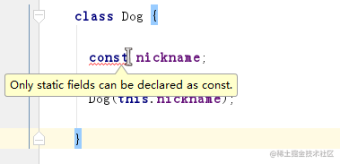

# Dart 常量

[](https://juejin.cn/user/184373684214733)

[cekiasoo](https://juejin.cn/user/184373684214733)

2018年09月22日 15:55 ·  阅读 3858

### 一、什么是常量

常量就是在运行期间不会被改变的数据，比如说有个存储单元这一秒存的数是 1，永远不可能会被改成 2；

### 二、如何定义常量

定义常量有两种方式，一种是用 final, 另一种是用 const,

#### （一）用 final 定义常量

final 数据类型 常量名 = 值;

```arduino
/**
 * 常量
 */
void main() {
  // final 定义常量
  final int age = 18;
}
复制代码
```

数据类型也可以省略

```arduino
/**
 * 常量
 */
void main() {
  // final 定义常量
  final age = 18;
}
复制代码
```

赋值后就不能改了，尝试修改会有警告，





> 强行运行就会报错；





#### （二）用 const 定义常量

const 数据类型 常量名 = 值;

```arduino
/**
 * 常量
 */
void main() {
  // const 定义常量
  const String name = 'xiaoming';
}
复制代码
```

const 的数据类型也是可以省略的，

```csharp
/**
 * 常量
 */
void main() {
  // const 定义常量
  const name = 'xiaoming';
}
复制代码
```

同样 const 常量赋值后就不能改了，





运行也是会报错的，





#### （三）final 和 const 的区别

看起来 final 和 const 是差不多的，其实是有区别的，final 可以不用先赋值，const 声明时必须赋值，不然会报错，

final 的 nickname 声明时没赋值不会报错





const 的 nickname 声明时没赋值直接红线报错了


