# Dart 赋值运算符

[](https://juejin.cn/user/184373684214733)

[cekiasoo](https://juejin.cn/user/184373684214733)

2018年09月22日 16:09 ·  阅读 440

### 一、什么是赋值运算符

赋值运算符就是把右边的值赋给左边，比如之前见过的 "=", 还有一些是运算和赋值同时进行的符号，Dart 中赋值运算符有

| 运算符 | 解释               |
| ------ | ------------------ |
| =      | 赋值               |
| +=     | 加法运算并赋值     |
| -=     | 减法运算并赋值     |
| *=     | 乘法运算并赋值     |
| /=     | 除法运算并赋值     |
| %=     | 求余运算并赋值     |
| ~/=    | 取整运算并赋值     |
| <<=    | 左移运算并赋值     |
| >>=    | 右移运算并赋值     |
| &=     | 按位与运算并赋值   |
| =      | 按位或运算并赋值   |
| ^=     | 按位异或运算并赋值 |


### 二、赋值运算符的用法

#### （一） 赋值

赋值就是把右边的值赋给左边，在 Dart 中用 "=" 表示，这不是等号，等号是 "==",

```ini
  var num = 5;
  print('a = $num');
复制代码
```


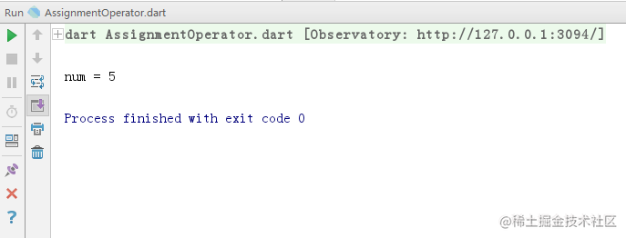


#### （二） 加法运算并赋值

加法运算并赋值就是先用左边的值和右边的值做加法运算然后把结果赋给左边，在 Dart 中用 "+=" 表示，

```ini
  var num = 8;
  num += 2;
  print('num = $num');
复制代码
```


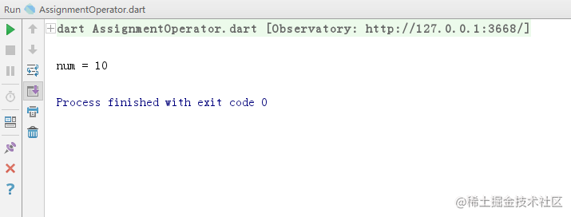

把 "+=" 运算拆分开来相当于


```ini
  var num = 8;
  num = num + 2;
  print('num = $num');
复制代码
```


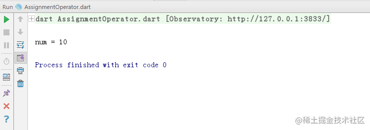


#### （三） 减法运算并赋值

减法运算并赋值就是先用左边的值减去右边的值然后把结果赋给左边，在 Dart 中用 "-=" 表示，

```ini
  var num = 8;
  num -= 2;
  print('num = $num');
复制代码
```


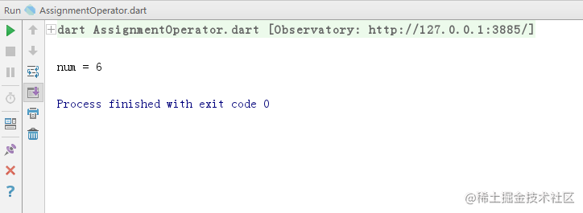


把 "-=" 运算拆分开来相当于

```ini
  var num = 8;
  num = num - 2;
  print('num = $num');
复制代码
```


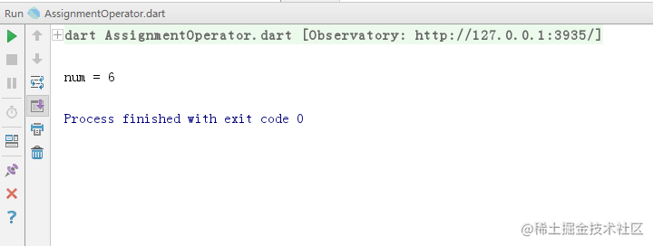


#### （三） 乘法运算并赋值

乘法运算并赋值就是先用左边的值和右边的值做乘法运算然后把结果赋给左边，在 Dart 中用 "*=" 表示，

```ini
  var num = 8;
  num *= 2;
  print('num = $num');
复制代码
```


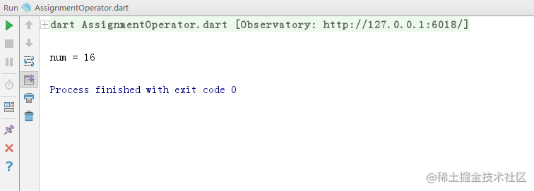


把 "*=" 运算拆分开来相当于

```ini
  var num = 8;
  num = num * 2;
  print('num = $num');
复制代码
```


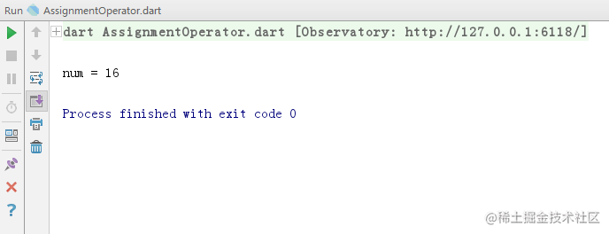


#### （四） 除法运算并赋值

除法运算并赋值就是先用左边的值除以右边的值然后把结果赋给左边，在 Dart 中用 "/=" 表示，

```ini
  var num = 8;
  num /= 2.2;
  print('num = $num');
复制代码
```


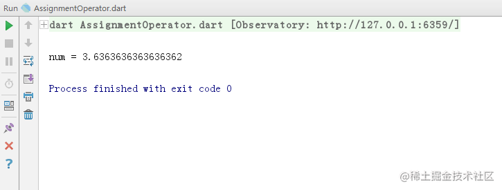


把 "/=" 运算拆分开来相当于

```ini
  var num = 8;
  num = num / 2.2;
  print('num = $num');
复制代码
```


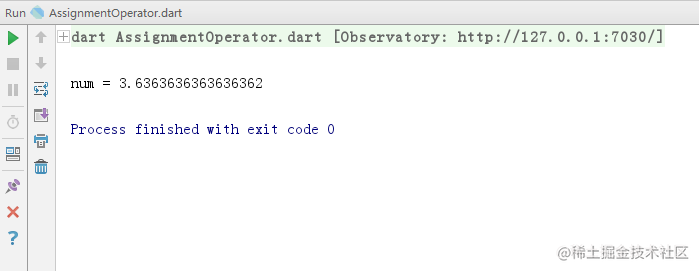


#### （五） 求余运算并赋值

求余运算并赋值就是先用左边的值对右边的值进行求余运算然后把结果赋给左边，在 Dart 中用 "%=" 表示，

```ini
  var num = 8;
  num %= 3;
  print('num = $num');
复制代码
```


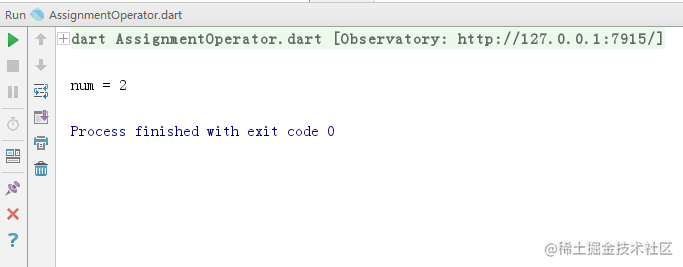


把 "%=" 运算拆分开来相当于

```ini
  var num = 8;
  num = num % 3;
  print('num = $num');
复制代码
```


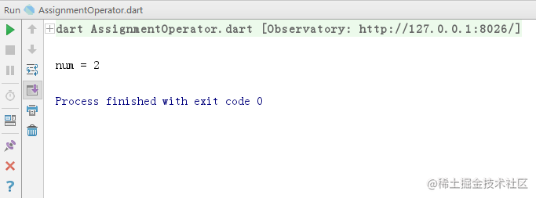


#### （六） 取整运算并赋值

取整运算并赋值就是先用左边的值除以右边的值取整数然后把结果赋给左边，在 Dart 中用 "~/=" 表示，

```ini
  var num = 8;
  num ~/= 2.2;
  print('num = $num');
复制代码
```


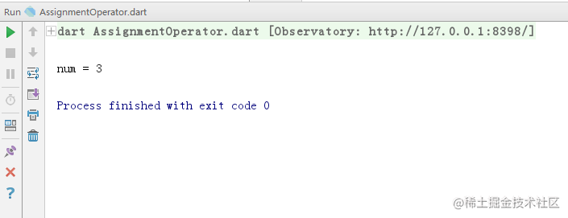


把 "~/=" 运算拆分开来相当于

```ini
  var num = 8;
  num = num ~/ 2.2;
  print('num = $num');
复制代码
```


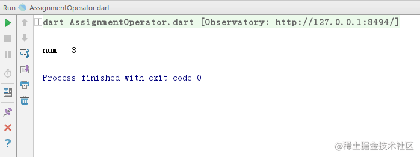


#### （七） 左移运算并赋值

左移运算并赋值就是先用左边的值的二进制位向左移动右边值个位，得到的结果赋给左边，在 Dart 中用 "<<=" 表示，

```ini
  var num = 8;
  num <<= 2;
  print('num = $num');
复制代码
```


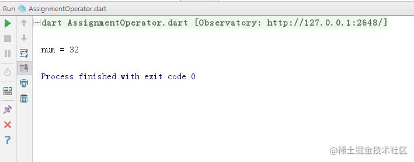


把 "<<=" 运算拆分开来相当于

```ini
  var num = 8;
  num = num << 2;
  print('num = $num');
复制代码
```


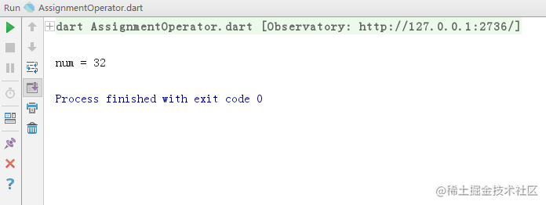


#### （八） 右移运算并赋值

右移运算并赋值就是先用左边的值的二进制位向右移动右边值个位，得到的结果赋给左边，在 Dart 中用 ">>=" 表示，

```ini
  var num = 8;
  num >>= 2;
  print('num = $num');
复制代码
```


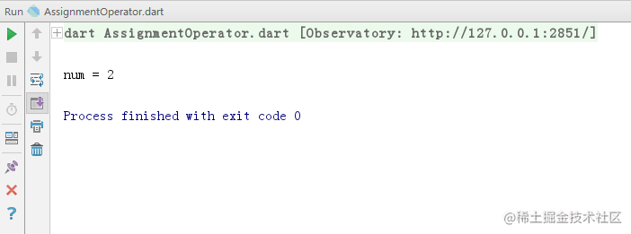


把 ">>=" 运算拆分开来相当于

```ini
  var num = 8;
  num = num >> 2;
  print('num = $num');
复制代码
```


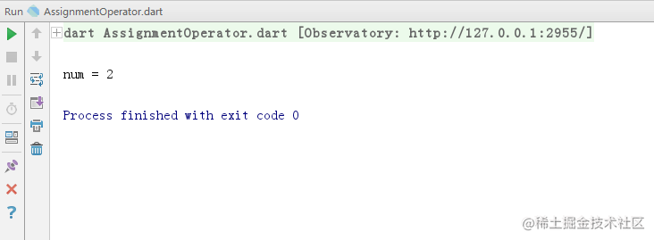


#### （九） 按位与运算并赋值

按位与运算并赋值就是先用左边的值的二进制对右边的值的二进制进行按位与运算然后把结果赋给左边，在 Dart 中用 "&=" 表示，

```ini
  var num = 5;
  num &= 22;
  print('num = $num');
复制代码
```


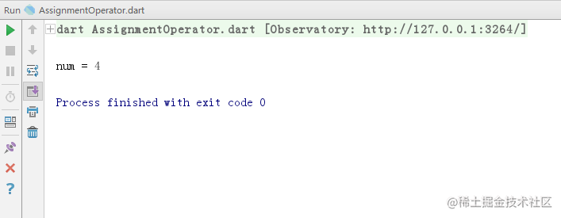


把 "&=" 运算拆分开来相当于

```ini
  var num = 5;
  num = num & 22;
  print('num = $num');
复制代码
```


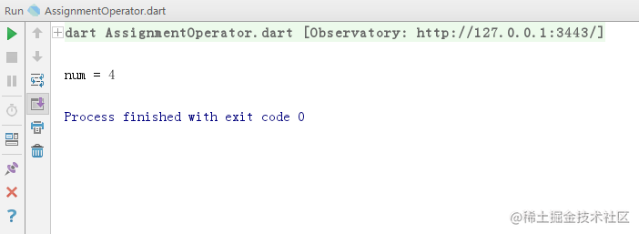


#### （十） 按位或运算并赋值

按位或运算并赋值就是先用左边的值的二进制对右边的值的二进制进行按位或运算然后把结果赋给左边，在 Dart 中用 "|=" 表示，

```ini
  var num = 5;
  num |= 22;
  print('num = $num');
复制代码
```


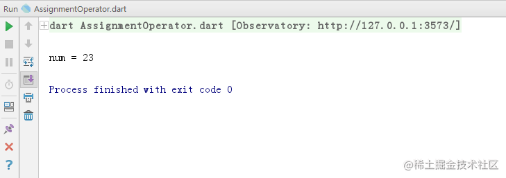


把 "|=" 运算拆分开来相当于

```ini
  var num = 5;
  num = num | 22;
  print('num = $num');
复制代码
```


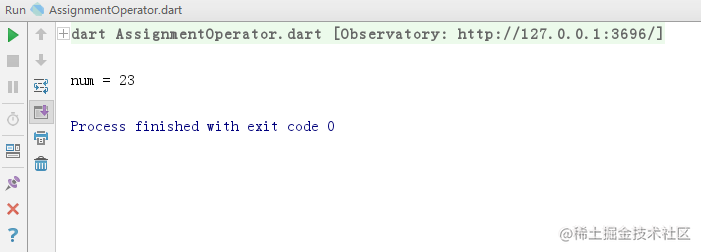


#### （十一） 按位异或运算并赋值

按位异或运算并赋值就是先用左边的值的二进制对右边的值的二进制进行按位异或运算然后把结果赋给左边，在 Dart 中用 "^=" 表示，

```ini
  var num = 8;
  num ^= 2;
  print('num = $num');
复制代码
```


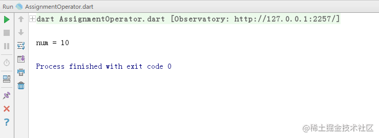


把 "^=" 运算拆分开来相当于

```ini
  var num = 8;
  num = num ^ 2;
  print('num = $num');
复制代码
```