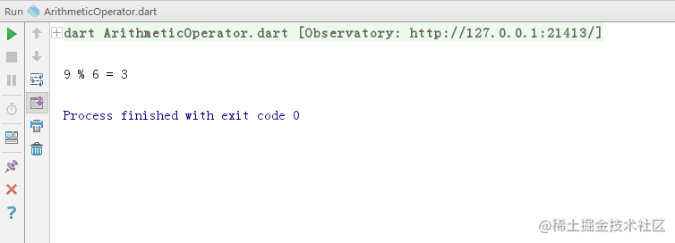

# Dart 算术运算符

[](https://juejin.cn/user/184373684214733)

[cekiasoo](https://juejin.cn/user/184373684214733)

2018年09月22日 16:02 ·  阅读 6389

### 一、什么是算术运算符

算术运算符就是加减乘除等四则运算操作的符号，如 + 、-、*、/ 等，Dart 中的算术运算符有

| 运算符 | 解释     |
| ------ | -------- |
| +      | 加法     |
| -      | 减法     |
| *      | 乘法     |
| /      | 除法     |
| %      | 求余     |
| -expr  | 取负     |
| ++     | 自增 1   |
| --     | 自减 1   |
| ~/     | 取整除法 |

### 二、算术运算符的用法

#### （一） 加法

用法： var 值 = 数1 + 数2;

```ini
  int a = 10;
  int b = 12;
  int c = a + b;
  print('$a + $b = $c');
复制代码
```


#### （二） 减法

用法： var 值 = 数1 - 数2;

```ini
  int a = 20;
  int b = 12;
  int c = a - b;
  print('$a - $b = $c');
复制代码
```


#### （三） 乘法

用法： var 值 = 数1 * 数2;

```ini
  int a = 3;
  int b = 7;
  int c = a * b;
  print('$a * $b = $c');
复制代码
```


#### （四） 除法

用法： var 值 = 数1 / 数2;
对于除法返回的值是 double 类型的，毕竟有可能是含小数的，

```ini
  int a = 3;
  int b = 7;
  double c = a / b;
  print('$a / $b = $c');
复制代码
```


#### （五） 求余

用法： var 值 = 数1 % 数2;

```ini
  int a = 9;
  int b = 6;
  int c = a % b;
  print('$a % $b = $c');
复制代码
```





#### （六）取负

取负就是一个数如果是正的取负就把这个数变负数，如果一个数是负的就把这个数变正数，
用法： var 值 = -数;

```ini
  int a = 10;
  int b = -a;
  print('b = $b');
复制代码
```


#### （七） 自增 1

自增 1 就是在原来的数的基础上加一，自增有分前自增和后自增，单独使用的时候没分别，在不是单独使用的时候就有区别了，

后自增的用法：

```ini
var num = 10;
num++;
print('num = $num');
复制代码
```


前自增的用法：

```ini
var num = 5;
++num;
print('num = $num');
复制代码
```


比较下前自增和后自增的区别吧，

```ini
  var num = 5;
  var value = num++;
  print('num = $num, value = $value');
复制代码
```

后自增是先取值再增 1 ，这里 num 是先把值赋给 value，num 再自增 1，所以 num 是 6，value 是 5，


```ini
  var num = 5;
  var value = ++num;
  print('num = $num, value = $value');
复制代码
```

前自增是先增 1 再取值，这里 num 是先自增 1，再把 num 值赋给 value ，所以 num 是 6，value 也是 6，


#### （八） 自减 1

自增 1 就是在原来的数的基础上减一，和自增一样，也有分前自减和后自减，单独使用的时候没分别，在不是单独使用的时候有区别， 后自减的用法：

```ini
var num = 10;
num--;
print('num = $num');
复制代码
```


前自减的用法：

```ini
var num = 5;
--num;
print('num = $num');
复制代码
```


前自减与后自减的区别

```ini
  var num = 5;
  var value = num--;
  print('num = $num, value = $value');
复制代码
```


```ini
  var num = 5;
  var value = --num;
  print('num = $num, value = $value');
复制代码
```


和自增一样，前自减是先减 1 再取值，后自减是先取值再减 1 ；

#### （九） 取整除法

取整除法就是两个数相除结果取整数部分，比如 10 除以 3 结果本来是 3.333... , 取整的结果就是 3 ，

```ini
  int a = 10;
  int b = 3;
  int c = a ~/ b;
  print('$a ~/ $b = $c');
```