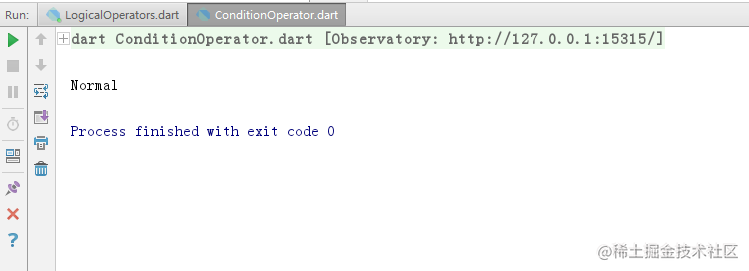

# Dart 三元运算符

[](https://juejin.cn/user/184373684214733)

[cekiasoo](https://juejin.cn/user/184373684214733)

2018年09月22日 16:08 ·  阅读 6354

### 一、三元运算符的用法

三元运算符的用法为：
bool-expr ? value1 : value2;
如果 bool-expr 为 true 就返回 value1, 如果 bool-expr 为 false 就返回 value2，比如说如果他的另一半是女的那他是正常的，否则他就是 Gay (此处应有去污粉)，

```ini
bool isGirl = true;
String hobby = isGirl ? 'Normal' : 'Gay';
print(hobby);
复制代码
```


