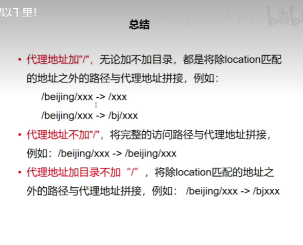

# nginx专题

## nginx七大应用场景
- web服务器
  请给出，nginx作为web服务器的常见配置conf文件，要求可以直接使用。

```text
server {
    listen 80;
    server_name example.com;

    # 根目录
    root /var/www/example.com;

    # 索引文件
    index index.html index.php;

    # SSL 证书
    ssl_certificate /path/to/certificate.crt;
    ssl_certificate_key /path/to/certificate.key;

    # HTTP 标头安全（HSTS）
    add_header Strict-Transport-Security "max-age=31536000";

    # 缓存
    location /static {
        expires 30d;
    }

    # Gzip 压缩
    gzip on;
    gzip_types text/plain text/css text/javascript application/javascript application/x-javascript;

    # keepalive 连接
    keepalive_timeout 65;

    # FastCGI 配置
    location ~ \.php$ {
        fastcgi_pass 127.0.0.1:9000;
        fastcgi_index index.php;
        fastcgi_param SCRIPT_FILENAME $document_root$fastcgi_script_name;
        include fastcgi_params;
    }

    # 错误页面
    error_page 404 /404.html;
    error_page 500 /500.html;

    # 日志记录
    access_log /var/log/nginx/example.com-access.log;
    error_log /var/log/nginx/example.com-error.log;
}
```

- 反向代理
- 负载均衡
  请给出，nginx作为web服务器的常见配置conf文件，要求可以直接使用。

```
server {
    listen 80;
    server_name example.com;

    # 将请求转发到后端服务器
    location / {
        proxy_pass http://backend-server:8080;
    }

    # SSL 证书
    ssl_certificate /path/to/certificate.crt;
    ssl_certificate_key /path/to/certificate.key;

    # HTTP 标头安全（HSTS）
    add_header Strict-Transport-Security "max-age=31536000";

    # keepalive 连接
    keepalive_timeout 65;

    # 负载均衡
    upstream backend-servers {
        # 负载均衡策略
        ip_hash;
        server backend-server1:8080;
        server backend-server2:8080;
    }

    # 将请求负载均衡到后端服务器
    location /api {
        proxy_pass http://backend-servers;
        proxy_set_header Host $host 
        proxy_set_header X-Real-IP $remote_addr
    }

    # 日志记录
    access_log /var/log/nginx/example.com-access.log;
    error_log /var/log/nginx/example.com-error.log;
}
```

## URL重定向

## 防盗链

```
server {
    listen 80;
    server_name example.com;

    # 允许来自自身网站的请求
    location / {
        allow all;
    }

    # 阻止来自其他网站的请求
    location / {
        valid_referers none blocked server_names example.com *.example.com;
        if (invalid_referer) {
            return 403;
        }
    }
}

```
## 根据变量重定向
```
server {
    listen 80;
    server_name example.com;

    # 将包含 "ipad" 的 user-agent 的请求重定向到 test.com
    location / {
        if ($http_user_agent ~* "ipad") {
            return 301 https://test.com$request_uri;
        }

        # 对于其他请求，正常处理
        ...
    }
}

```

## 也可以根据请求路径转发到响应的服务

## nginx匹配路径`/`


## nginx配置图形化界面

nginx proxy manager 官网地址： https://nginxproxymanager.com/guide/

Create a docker-compose.yml file similar to this:
```yml
version: '3.8'
services:
  app:
    image: 'jc21/nginx-proxy-manager:latest'
    restart: unless-stopped
    ports:
      - '80:80'
      - '81:81'
      - '443:443'
    volumes:
      - ./data:/data
      - ./letsencrypt:/etc/letsencrypt
```

 