# GitHub Actions

CI/CD的工具

当我们提交代码的时候,可以触发流水线.

我们的目的是自动构建 `gitbook build`,并将编译好的代码`静态页面`提交到个人仓库中,

并自动更新到`github pages`.

# 配置secrets
## 创建token
- 在个人中心配置需要的token
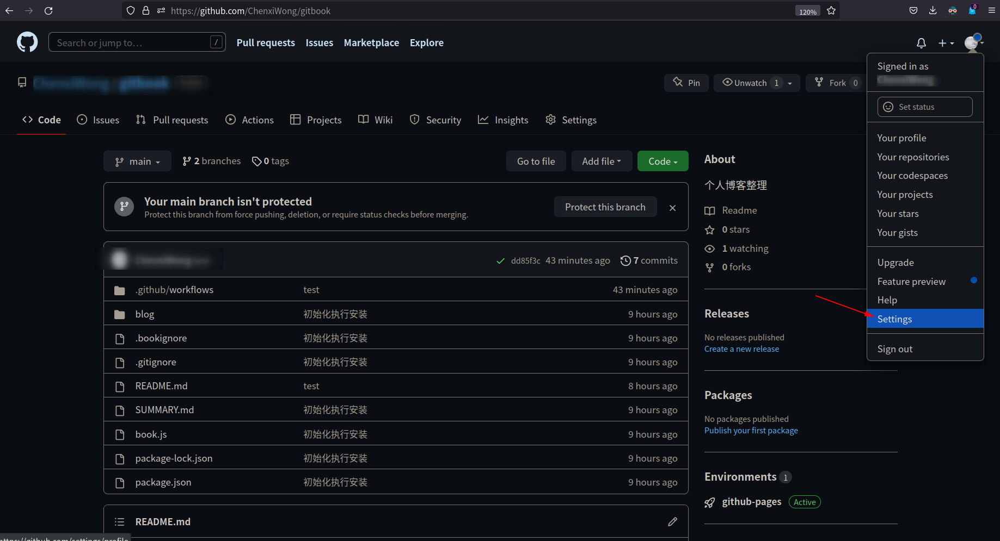
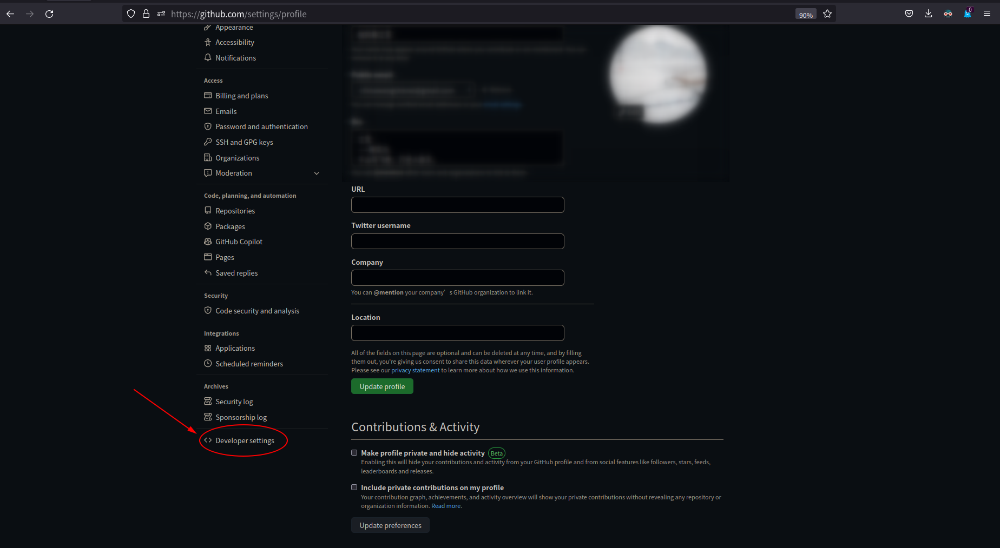
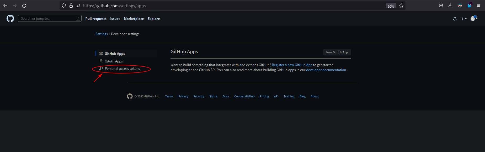
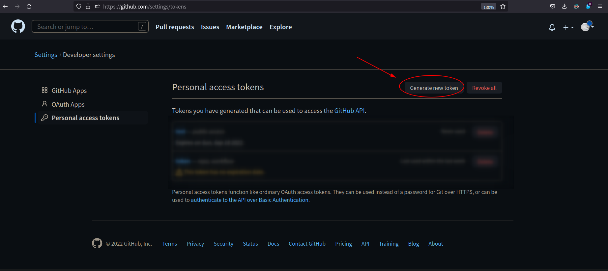
- 根据需求填写对应的信息、重点关注workflow权限
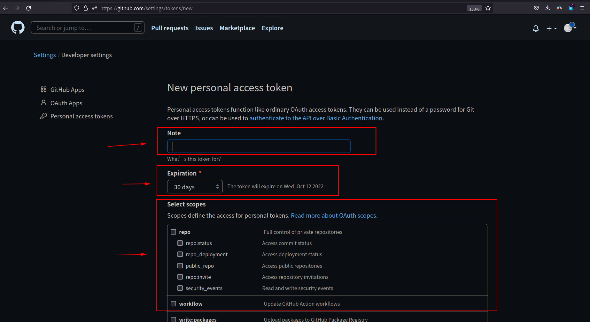
- 填写完成创建token
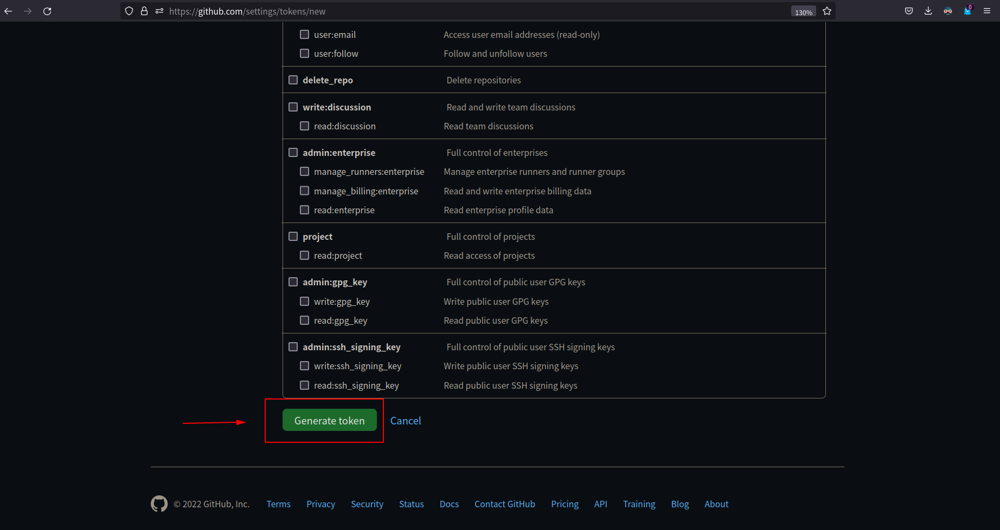
- 复制对应的token字符串
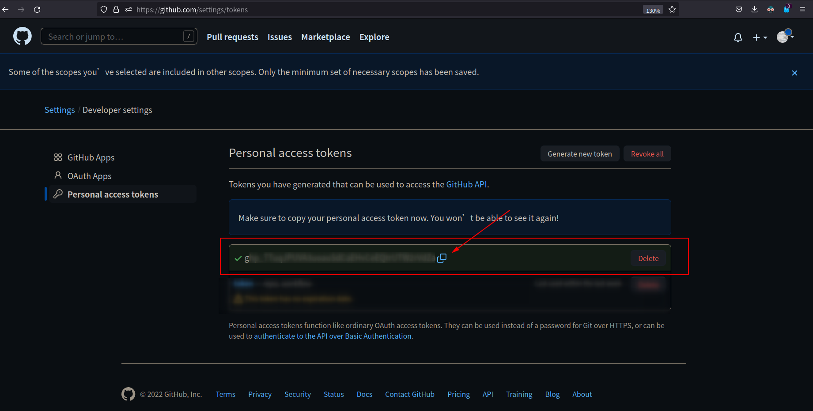
- 将token字符串填写到项目token中
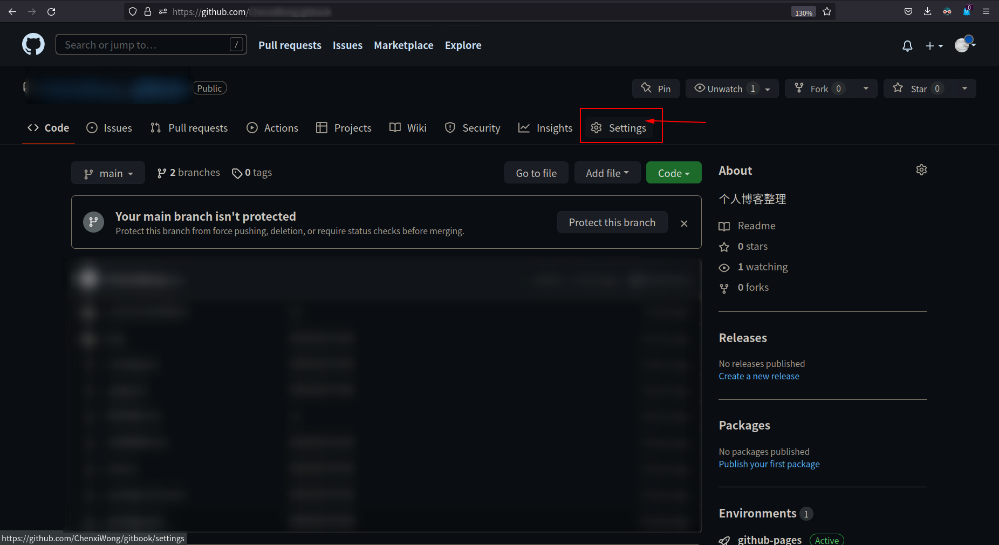
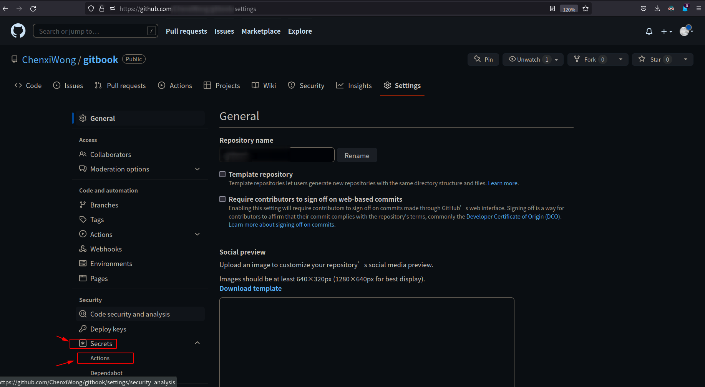
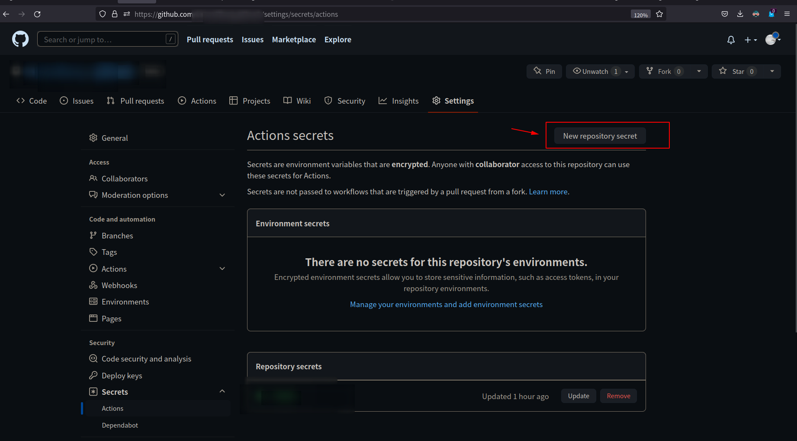
- 填写copy的token字符串提交，即可创建完成
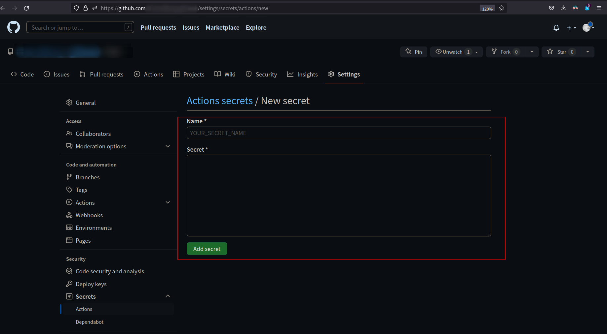
- 注意最后一步的token name，就是workflow中的使用名称
# CI脚本

工作流程在 `.github/workflows` 目录中定义,此目录下所有`yml`文件都会被执行.

`.github/workflows/ci.yml` 如我们的文件编辑如下

> 当我们推送代码,触发Actions时
>
> 1. 切换到主分支main
> 2. 安装node.js 因为我们的gitbook依赖
> 3. 安装gitbook
> 4. 安装gitbook服务需要的各种插件
> 5. 执行git build,生成_book目录
> 6. 将_book目录内容,推送到仓库的gh-pages分支
>
> 做完以上步骤,github pages也会触发一个流水线,将`gh-pages`内容更新.

```yml
name: auto-generate-gitbook
on:                                 #在main分支上进行push时触发
  push:
    branches:
      - main

jobs:
  main-to-gh-pages:
    runs-on: ubuntu-latest

    steps:
      - name: checkout main
        uses: actions/checkout@v2
        with:
          ref: main

      - name: install nodejs
        uses: actions/setup-node@v1

      - name: configue gitbook
        run: |
          npm install -g gitbook-cli
          npm install gitbook-plugin-search-pro
          npm install gitbook-plugin-chapter-fold
          npm install gitbook-plugin-sitemap
          npm install gitbook-plugin-theme-lou
          npm install gitbook-plugin-back-to-top-button
          npm install gitbook-plugin-code
          npm install gitbook-plugin-prism

      - name: generate _book folder
        run: |
          gitbook build
          cp SUMMARY.md _book

      - name: push _book to branch gh-pages
        env:
          TOKEN: ${{ secrets.TOKEN }}
          REF: github.com/${{github.repository}}
          MYEMAIL: xxxxxxxxx@qq.com                    # ！！！ 记得修改为自己github设置的邮箱
          MYNAME: ${{github.repository_owner}}
        run: |
          cd _book
          git config --global user.email "${MYEMAIL}"
          git config --global user.name "${MYNAME}"
          git init
          git remote add origin https://${REF}
          git add .
          git commit -m "Updated By Github Actions With Build ${{github.run_number}} of ${{github.workflow}} For Github Pages"
          git branch -M main
          git push --force --quiet "https://${TOKEN}@${REF}" main:gh-pages
```