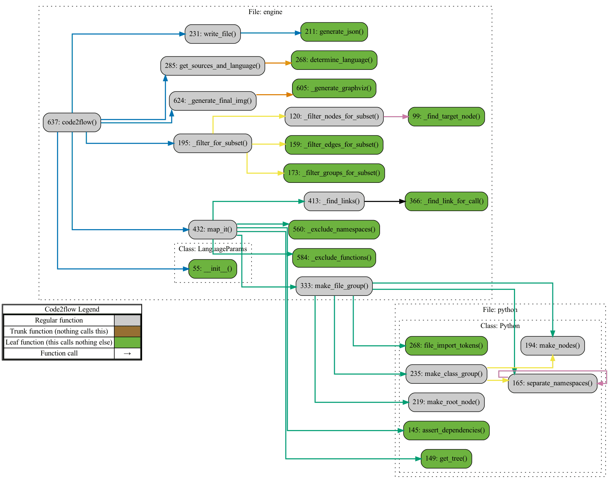

# code2flow

34.[code2flow](https://github.com/scottrogowski/code2flow)


Star 2.7kFork 220

Watch 68

为动态语言生成调用图的工具。可根据源码文件生成漂亮的调用图的命令行工具，支持 Python、JavaScript、Ruby 等动态语言。

```
# 安装
pip3 install code2flow
# 使用
code2flow 文件
```

