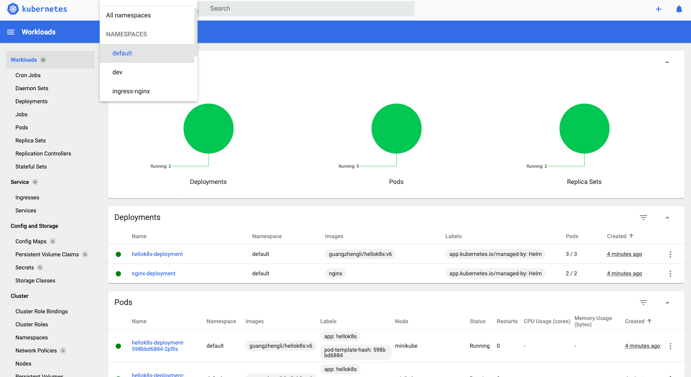

# k8s
11.[k8s-tutorials](https://github.com/guangzhengli/k8s-tutorials)

Star 1.4kFork 113

Watch 13

免费的 Kubernetes 教程。K8s 作为云原生时代的必备技能之一，多少得会一些。该教程侧重于实战引导，用 Go  写的项目作为演示对象，从最基础的容器定义开始，逐一讲述 pod、deployment、service、ingress 等资源，直到用 helm  打包部署一套完整服务。

