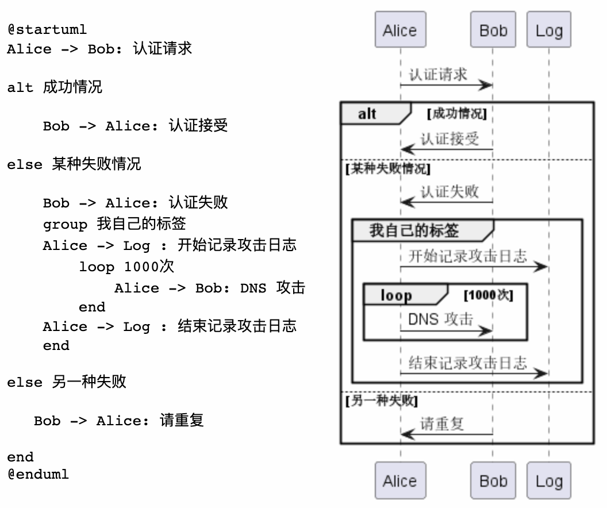

# plantUML
16.[plantuml](https://github.com/plantuml/plantuml)


Star 7kFork 697

Watch 146

从文本描述生成 UML 图的工具。该项目可根据简单的文字描述画出 UML 图，支持顺序图、用例图、时序图等，除此之外还支持架构图、甘特图、思维导图、实体关系图等非 UML 图。支持在线、命令行、桌面应用等多种使用方式，可根据情况自行选择。

```
java -jar plantuml.jar 文本文件
将得到一个同名的 png 文件
```



### 本地使用参照官方文档本地安装配置
### Vscode有相应的插件
是一个梳理流程的好工具。