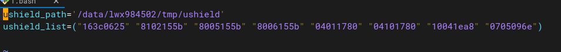
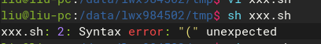
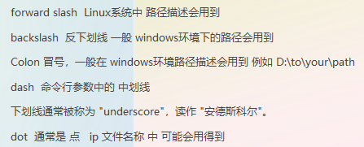
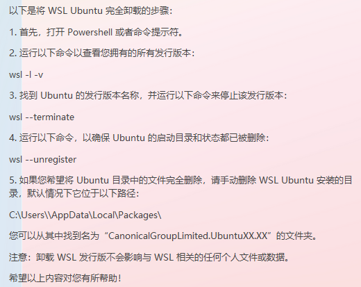

# questions

- chatGML 问题模板 代码截图识别
```text
请将图片中的代码，识别输出(包含注释)。请注意，识别的文本是python代码，请输出格式化后的python代码。
请将图片中的文本，识别输出（包含表头）。请注意，识别的文本是csv格式的文本，请按照`csv`格式输出。
```

- python, sqlmap报错 AttributeError: module ‘collections‘ has no attribute ‘Callable‘

```text
进入python安装目录 如我的在e盘下修改py3k_compat.py这个文件E:\python\lib\site-packages\pyreadline\py3k_compat.py

在第8行把 return isinstance(x, collections.Callable)改为 return isinstance(x, collections.abc.Callable)即可正常使用
```

- 问题描述

这个脚本只能用bash执行，用sh执行报错

现在有个场景是必须用sh来执行，不能用bash，要怎么改脚本

解决方法
```bash
ushield_list=`echo "163c0625" "8102155b" "8005155b" "8006155b" "04011780" "04101780" "10041ea8" "0705096e" `
for i in $ushield_list
do
echo $i
done
```

- 计算机常用术语



- Windows WSL 卸载 ubuntu



- ubuntu系统如何修改hostname
```text
1. 需要编辑/etc/hostname文件。使用文本编辑器以超级用户权限打开此文件：
sudo vi /etc/hostname
删除旧的主机名，并输入新的主机名。保存并关闭文件。
2. 同样，您还需要编辑/etc/hosts文件，以确保该文件中的主机名与您刚刚设置的新主机名相匹配。同样使用文本编辑器以超级用户权限打开此文件：
sudo vi /etc/hosts
找到包含127.0.1.1的行，并更改该行的主机名部分以匹配新的主机名。保存并关闭文件。
3. 重启计算机或注销会话以使更改生效：
sudo reboot
4. 或者如果您只是想测试更改而不立即重启：
hostnamectl
这将显示当前的主机名设置，包括您刚才所做的更改。
```

- 问题描述
ctr镜像导入报错ctr: content digest sha256:xxxxxx not found

解决方案
```text
现象：
直接导入j镜像可能会出现类似于 ctr: content digest sha256:xxxxxx not found
解决办法：
拉取镜像、导出镜像时，加上--platform
```

