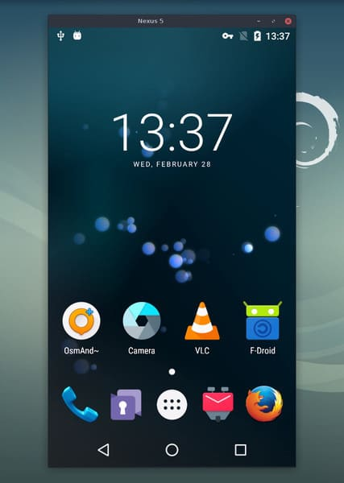

2.[scrcpy](https://github.com/Genymobile/scrcpy)

Star 7.2wFork 7.7k

Watch 1.1k

一款可以用电脑显示并控制 Android 手机的开源工具。连接方便使用方便，手机无需 root、无需安装任何应用。支持 USB、Wi-Fi 两种方式连接，支持 Windows、macOS、Linux 三种操作系统。注意电脑端需要安装 adb 工具

