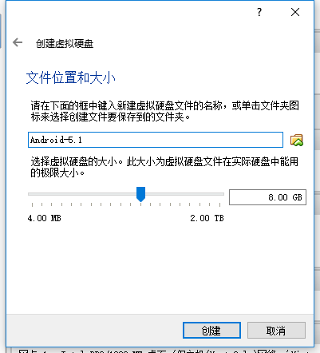
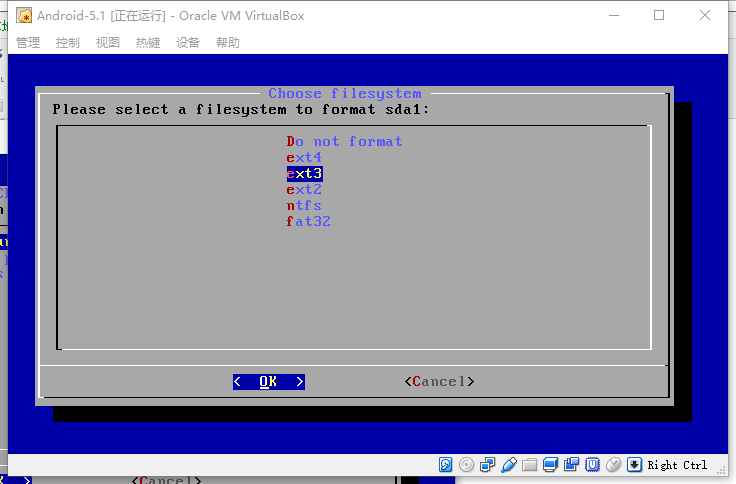
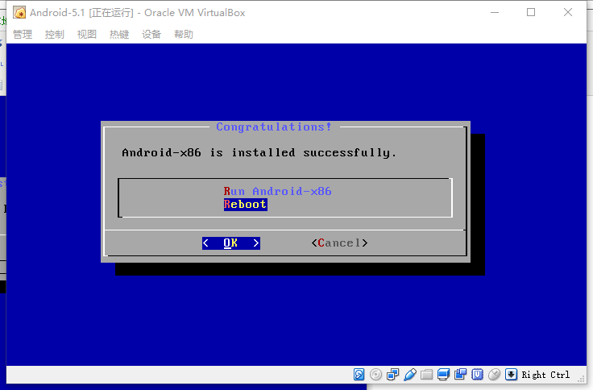

#                  [     VirtualBox中安装Android-x86详解      ](https://www.cnblogs.com/wynn0123/p/6288344.html)             

# 1.下载安装VirtualBox

官网：http://www.virtualbox.org/wiki/Downloads

# 2.下载Android-x86

官网：http://www.android-x86.org/download


这里我们下载5.1稳定版

# 3.新建VirtualBox虚拟机，并进行相关配置




创建好之后如下：


右键->设置->系统， 修改指点设备为PS/2鼠标


显示：显存设置为最大，并启用3D加速


网络：修改为桥接网卡（默认的NAT方式主机无法访问虚拟机）


# 4.安装Android-x86

双击打开上面创建的虚拟机，加载android-x86-5.1-rc1.iso镜像，如下


前3个都是光盘启动Android-x86系统，无需安装。我们选择最后一项，回车开始安装，如下


接着选择第二项，创建新分区，如下


选择NO，回车


选择NEW->Primary，默认大小，回车，如下


选择Bootable作为启动分区，回车，如下


选择Write回车，然后填写yes并回车，把上面的操作全部写入磁盘，如下


然后Quit，回到安装界面，选择第一项sda1，回车


分区格式我们这里选择**ext3**，官方推荐ntfs，但实际测试选择ntfs系统无法启动。



Yes


GRUB，即启动系统时的引导界面，Yes


EFI GRUB2，选择Skip


Yes


正在写入：


安装成功，Reboot，重启



这时还是会加载ISO进入系统安装界面，因为我们还没移除虚拟盘，点击移除虚拟盘，然后控制->重启


顺利进入GRUB，选择第一项启动Android-x86


选择简体中文，然后依次点击屏幕的ABCD四个位置，这样可以跳过设置向导，如下


然后进入桌面，如下


 

下面我们就可以在PC上随意调试安卓程序了~


在安装Android-x86后，由于nVidia显卡驱动的原因启动过程中可能会卡住无法进入图形界面。此时在需要在启动参数中添加nomodeset选项来禁用显卡。其他Linux系统中遇到同样的问题也可以使用此方法解决。


# 常见问题
## 产生原因

> The newest kernels have moved the video mode setting into the kernel. So all the programming of the hardware specific clock rates and  registers on the video card happen in the kernel rather than in the X  driver when the X server starts.. This makes it possible to have high  resolution nice looking splash (boot) screens and flicker free  transitions from boot splash to login screen. Unfortunately, on some  cards this doesnt work properly and you end up with a black screen.  Adding the nomodeset parameter instructs the kernel to not load video  drivers and use BIOS modes instead until X is loaded.

某些显卡下Linux内核无法正常工作导致黑屏。

## 解决方法

开机后在grub界面选择第二项`Debug mode`，输入

```
mount –o remount,rw /mnt
```

再输入

```
vi /mnt/grub/menu.lst
```

在第七行的root前加入`quiet nomodeset`，修改后内容如下：

```
...
title Android-x86 8.1-r5
    kernel /android-8. 1-r5/kernel quiet nomodeset root=/dev/ram0 SRC=/android-8. 1-r5
    initrd /android-8. 1-r5/ initrd. img
...
```

按`ESC`退出编辑，并输入`:wq`保存退出。
重启后即可进入图形界面。
