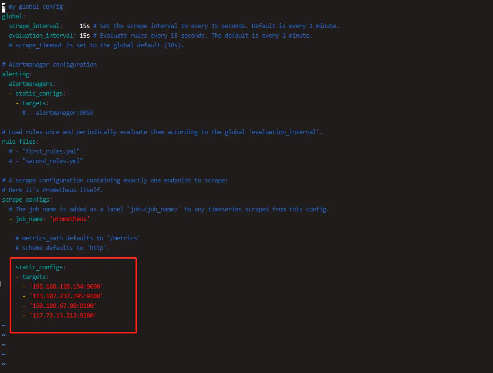
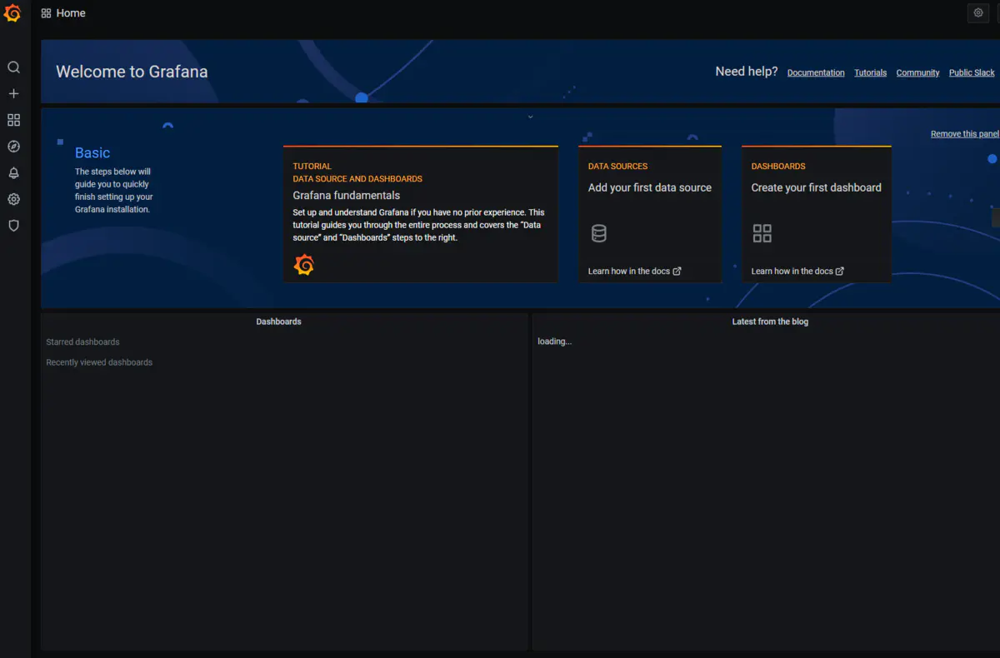
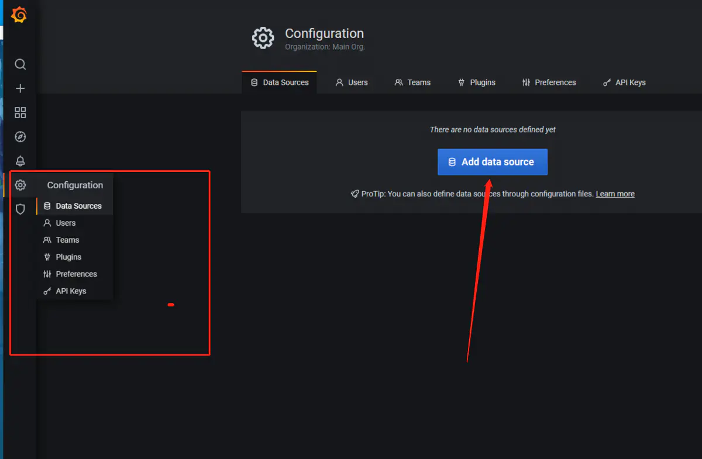
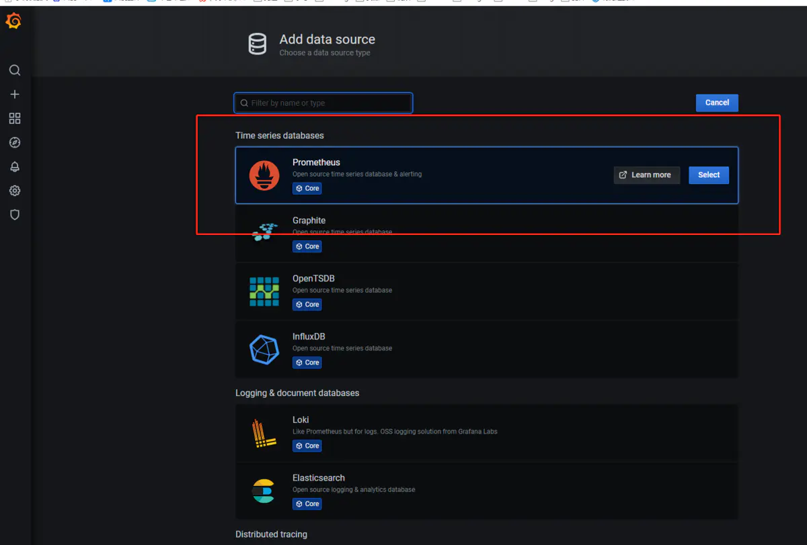
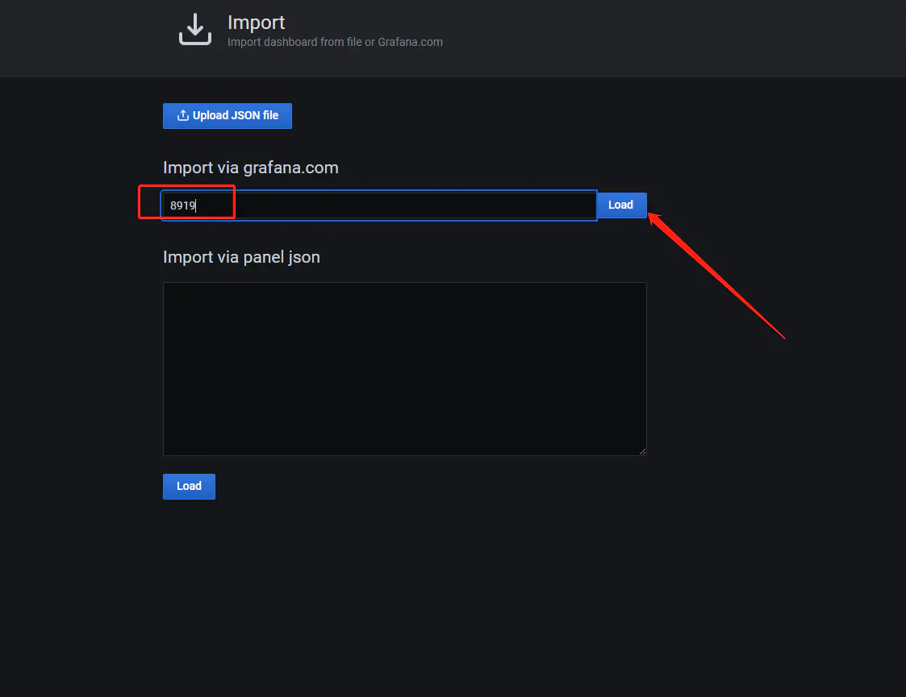

## 利用granfana、prometheus、node_exporter示例监控部署

### 下载prometheus、grafana、node_exporter程序。
```shell
    wget http://file.ethlink.cn/tools/prometheus.tar.gz
    wget http://file.ethlink.cn/tools/node_export.tar.gz
    wget http://file.ethlink.cn/tools/grafana_7.3.4_amd64.deb
```

### 解压tar包，安装grafana
```shell
    tar -zxvf prometheus.tar.gz
    tar -zxvf node_export.tar.gz
    dpkg -i grafana_7.3.4_amd64.deb
```
### 配置prometheus
    `cd prometheus-2.23.0.linux-amd64`
    `vim prometheus.yml`
    
    填写要监控的主机的IP，端口都是9100 。node_exporter服务端口就是9100。

### 启动prometheus
   `vim /etc/systemd/system/prometheus.service`
```shell
[Unit]
Description=Prometheus Monitoring System
Documentation=Prometheus Monitoring System
[Service]
ExecStart=/home/ubuntu22/tools/prometheus-2.38.0.linux-amd64/prometheus --config.file=/home/ubuntu22/tools/prometheus-2.38.0.linux-amd64/prometheus.yml --web.listen-address=:9090
Restart=on-failure
[Install]
WantedBy=multi-user.target
```
    加载、开机自启动、启动服务、查看服务、重启服务、停止服务
```shell
sudo /bin/systemctl daemon-reload
sudo systemctl start prometheus
sudo systemctl status prometheus
sudo systemctl restart prometheus
sudo systemctl stop prometheus
```


### 配置node
    `vim /etc/systemd/system/node_exporter.service`
    写入如下内容：
```tex
[Unit]
Description=node_exporter
Documentation=https://github.com/prometheus/node_exporter
[Service]
ExecStart=/home/wangchenxi/usr/node_exporter-1.4.0-rc.0.linux-amd64/node_exporter --collector.systemd --collector.processes
Restart=on-failure
[Install]
WantedBy=multi-user.target
```
    执行开机自启动服务、启动服务、查看状态
```shell
sudo systemctl daemon-reload
sudo systemctl enable node_exporter.service 
sudo systemctl start node_exporter.service 
sudo systemctl status node_exporter.service
```


### 配置webui
打开主机地址+3000端口。
例如：主机IP为192.168.22.23
浏览器输入以下地址：    `http://192.168.22.23:3000`

默认用户为 admin admin


登陆后修改密码


### 修改完密码进入主页。准备配置数据源

点击Add data source

选择prometheus

填入主机的IP,端口号为9090

点击保存并测试（save&test）


### 导入模板配置





### 搭建其他服务的监控
    1. 例如mysql、nginx这些都有对应的，监控模板和对应的node服务，可以自行查找攻略；
    2. 如果要监控自主开发的服务或系统，需要自己实现对应的prometheus_client，然后在prometheus中配置添加对应节点。

### ProQL
 如果要自己定义展示模板，可以学习prometheus的query language，简称`ProQL`。

