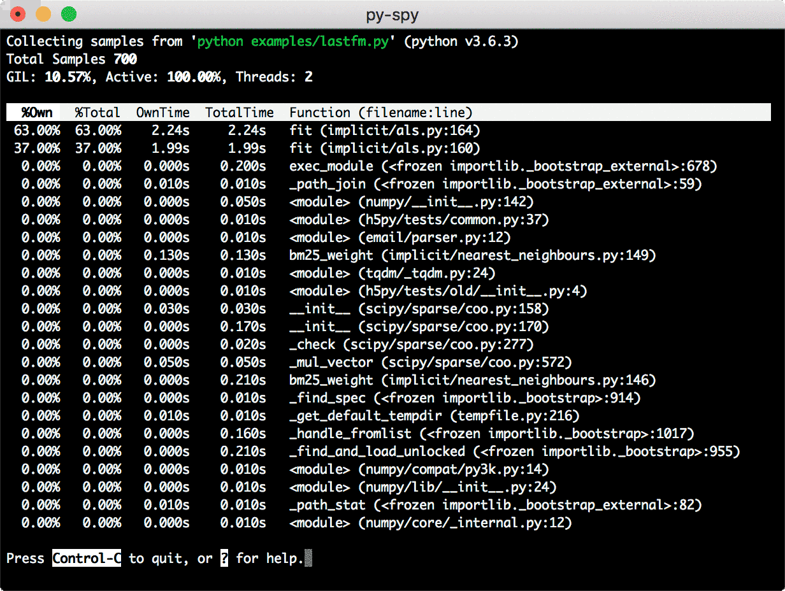

## 

## python性能分析工具py-spy

### 前言                             

  用 top 的方式分析 Python 程序性能的工具。一款 Python 程序性能分析工具，它可以让你在不重启程序或修改代码的情况，直观地看到 Python 程序中每个函数花费的时间。

### 安装
```
# 安装
pip install py-spy

# record 命令将配置文件记录到文件中，可用来生成火焰图
py-spy record -o profile.svg --pid 进程ID

# top 命令实时展示函数花费时间
py-spy top --pid 进程ID

# dump 命令显示每个 Python 线程的当前调用堆栈
py-spy dump --pid 进程ID
```

### 命令行示例


### 了解更多
[对应项目的github](https://github.com/benfred/py-spy)
