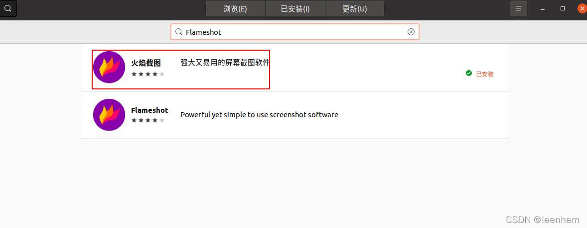
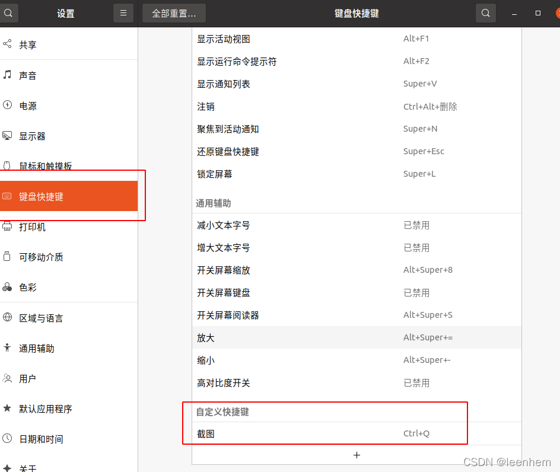

### 在 Linux 中使用 Flameshot 获取屏幕截图并编辑

------

### 功能概述

- 注释 (高亮、标示、添加文本、框选)
- 图片模糊
- 图片裁剪
- 上传到 Imgur
- 用另一个应用打开截图

如果你需要的是一个能够用于标注、模糊、上传到 imgur 的新式截图工具，那么 Flameshot 是一个好的选择。

### 安装截图工具Flameshot

------

如果你用的是 Ubuntu，那么只需要在 Ubuntu 软件中心上搜索，就可以找到 Flameshot 进而完成安装了


### 使用终端来安装，可以执行以下命令

------

```bash
sudo apt install flameshot
```

如果你在安装过程中遇到问题，可以按照[官方的安装说明](https://github.com/flameshot-org/flameshot#installation)进行操作
 安装完成后，你还需要进行配置。尽管可以通过搜索来随时启动 Flameshot，但如果想使用 快捷键 触发启动，则需要指定对应的键盘快捷键。

### 配置截图快捷键

- 进入系统设置中的“键盘设置”
- 页面中会列出所有现有的键盘快捷键，拉到底部就会看见一个 “+” 按钮
- 点击 “+” 按钮添加自定义快捷键并输入以下两个字段：
- “名称”： 任意名称均可。
- “命令”： /usr/bin/flameshot gui
- 最后将这个快捷操作绑定到 Ctrl+Q 键上，可能会提示与系统的截图功能相冲突，但可以忽略掉这个警告。

配置之后，你的自定义快捷键页面大概会是以下这样：
 


